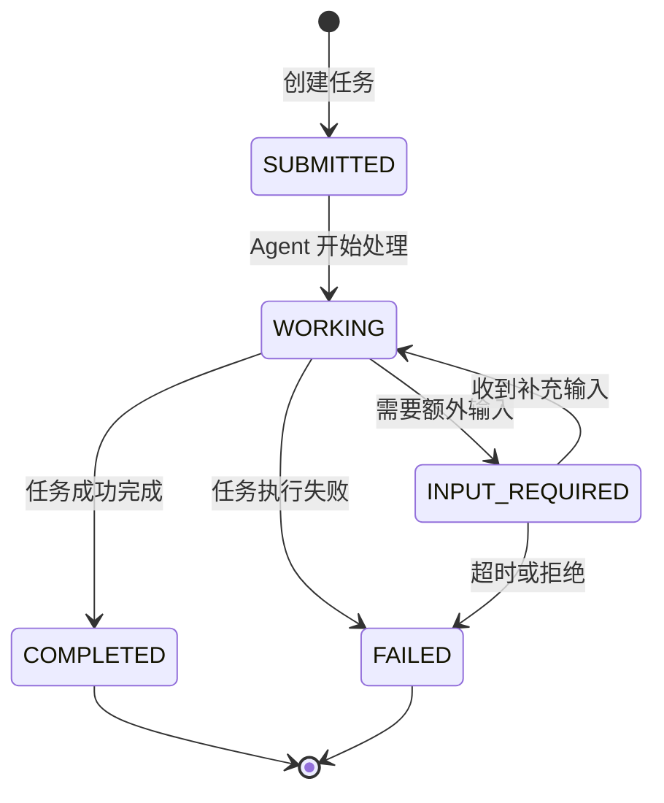
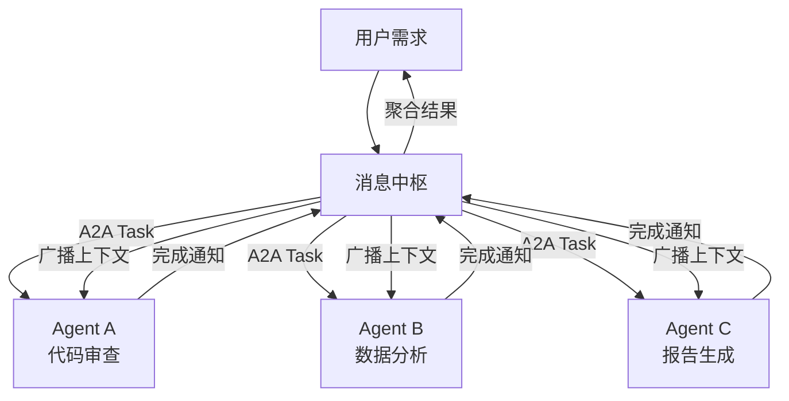

## 一、引言：Agent 时代的通信困境

大语言模型驱动的 Agent 正在从实验走向生产。当单个 Agent 的能力边界被不断拓展时，一个更复杂的问题浮现出来：多个 Agent 之间如何高效、可靠地协作？

传统的微服务通信模式（REST、gRPC、消息队列）在面对 Agent 场景时暴露出明显的不足。Agent 不是普通的微服务，它们具备自主决策能力、动态任务分解能力和不确定的执行时长。一个 Agent 可能正在等待外部 API 响应，另一个 Agent 可能需要人类确认输入，第三个 Agent 可能正在流式输出中间结果。这些异步的、长周期的、状态丰富的交互模式，让传统的同步 RPC 调用显得力不从心。

正是在这个背景下，A2A（Agent-to-Agent）协议应运而生。它不是又一个消息格式规范，而是为 Agent 间协作量身定制的通信标准。本文将系统介绍 A2A 协议的核心概念、生产落地进展，以及消息中间件在 Agent 协作架构中不可替代的五大价值。

---

## 二、A2A 协议核心概念

### 2.1 什么是 A2A 协议

A2A（Agent-to-Agent）协议由 Google 于 2025 年发起，现由 Linux基金会 Agentic AI Foundation 治理。截至 2026 年 5 月，A2A 协议已发布 v1.0 稳定版，获得 150 多家生产组织的支持。

> **官方资源**：
> - 官方网站：[a2aproject.github.io/A2A](https://a2aproject.github.io/A2A)
> - GitHub 仓库：[github.com/a2aproject/A2A](https://github.com/a2aproject/A2A)
> - 多语言文档（EN/ZH/JA）：[agent2agent.ren](https://agent2agent.ren)
> - Awesome A2A 资源汇总：[ai-boost/awesome-a2a](https://github.com/ai-boost/awesome-a2a)

A2A 协议定义了一套标准化的通信机制，使不同框架、不同厂商开发的 Agent 能够互相发现、理解并协作。它解决了三个核心问题：

- **发现**：Agent 如何让别人知道自己能做什么？
- **协商**：Agent 之间如何就任务目标、输入输出格式达成一致？
- **执行**：任务如何在多个 Agent 之间流转、跟踪和完成？

### 2.1.1 A2A 的五大设计原则

| 原则 | 说明 |
|------|------|
| **简洁性（Simple）** | 基于现有标准（HTTP、JSON-RPC 2.0、SSE），不重新发明轮子 |
| **企业就绪（Enterprise Ready）** | 认证、安全、隐私、监控对标企业级实践 |
| **异步优先（Async First）** | 原生支持长时间运行任务和人机交互（Human-in-the-Loop） |
| **模态无关（Modality Agnostic）** | 支持文本、文件、表单、流式等多种内容类型 |
| **黑盒执行（Opaque Execution）** | Agent 协作时不暴露内部逻辑、工具或记忆 |

### 2.1.2 A2A 工作流程（4 步）

1. **发现（Discovery）**：Agent 发布 `Agent Card`（JSON 格式），描述能力、端点和认证需求
2. **通信（Communication）**：Client Agent 通过 HTTP/JSON-RPC 2.0 向 Remote Agent（Server）发送 `Task` 请求（包含 `Message` 和 `Parts`）
3. **执行与响应（Execution & Response）**：Server 处理任务，更新 `status`，返回最终状态和生成的 `Artifact`（结果）
4. **更新（Updates）**：对于长任务，Server 可通过 SSE 流式推送 `TaskStatusUpdateEvent` 或 `TaskArtifactUpdateEvent`，或使用 Push Notifications

### 2.2 核心概念

#### 2.2.1 Agent Card — Agent 的身份名片

每个 A2A Agent 都通过一个自描述文件对外暴露自己的能力，这个文件位于 `/.well-known/agent-card.json` 路径下。Agent Card 包含以下关键信息：

```json
{
  "name": "代码审查 Agent",
  "description": "负责代码质量审查、安全漏洞检测和规范检查",
  "skills": [
    {
      "id": "code-review",
      "description": "对提交的代码进行静态分析和安全审查",
      "tags": ["security", "quality"]
    }
  ],
  "defaultInputModes": ["text", "code"],
  "defaultOutputModes": ["text", "json"],
  "securitySchemes": {
    "bearerAuth": {
      "type": "http",
      "scheme": "bearer"
    }
  }
}
```

Agent Card 相当于 Agent 的"名片"，其他 Agent 通过读取这张名片来决定是否与之协作、如何调用其能力。

#### 2.2.2 Task — 任务生命周期

Task 是 A2A 协议中任务执行的核心抽象。一个 Task 从创建到终结经历以下状态流转：



这种状态机设计充分考虑了 Agent 执行的不确定性。`INPUT_REQUIRED` 状态允许 Agent 在执行过程中向调用方请求更多信息，这是传统 RPC 模型无法优雅处理的场景。

#### 2.2.3 Message 与 Part — 通信单元

A2A 协议中的通信以 Message 为基本单位，每个 Message 由一个或多个 Part 组成。Part 是实际承载数据的载体，支持多种内容类型：

- **TextPart**：纯文本内容
- **DataPart**：结构化数据（JSON）
- **FilePart**：文件引用（含 URL 和 MIME 类型）
- **StreamingPart**：流式输出片段

这种设计使得 Agent 可以在单次通信中混合传递文本说明、结构化数据和文件引用，满足复杂协作场景的需求。

#### 2.2.4 Artifact — 产出物

当 Task 完成时，Agent 会产出一个或多个 Artifact。Artifact 是任务的最终成果，可以是代码、报告、分析结果等。每个 Artifact 包含内容、元数据（创建时间、格式、大小）和可选的签名信息，确保产出物的可追溯性和完整性。

### 2.3 A2A vs MCP：定位差异

理解 A2A 协议的关键在于厘清它与 MCP（Model Context Protocol）的关系。两者不是竞争关系，而是互补关系：

| 维度 | MCP | A2A |
|------|-----|-----|
| 通信方向 | Agent → Tool | Agent → Agent |
| 核心场景 | 模型访问外部工具和资源 | Agent 之间的任务委派与协作 |
| 抽象层级 | 工具调用（Tool Call） | 任务生命周期（Task Lifecycle） |
| 状态管理 | 无状态请求-响应 | 有状态任务跟踪 |
| 典型用例 | LLM 调用数据库查询工具 | 规划 Agent 将子任务委派给执行 Agent |

简而言之，MCP 解决的是"Agent 如何使用工具"的问题，A2A 解决的是"Agent 如何与其他 Agent 协作"的问题。一个完整的 Agent 系统往往同时需要两者。

### 2.4 消息中间件在 A2A 协作中的核心价值

A2A 协议定义了 Agent 间通信的标准格式和流程，但协议本身不规定传输层实现。这正是消息中间件发挥价值的地方。对于有 Java 后端经验、熟悉消息中间件的工程师来说，以下五大价值点应该非常直观。

#### 2.4.1 异步解耦

Agent 的执行时长是不确定的。一个代码审查 Agent 可能几秒完成，一个数据分析 Agent 可能需要几分钟甚至更久。如果采用同步 RPC 调用，调用方必须阻塞等待，这不仅浪费资源，还容易引发级联超时。

消息中间件通过 Topic/Queue 将调用方和执行方解耦。调用方将 Task 请求发布到消息队列后即可返回，执行方按自身节奏消费和处理。这种异步模式天然适配 Agent 的长周期执行特性。

#### 2.4.2 语义路由与动态调度

A2A 协议中的 Agent Card 描述了每个 Agent 的技能标签和能力范围。消息中间件可以基于这些元数据实现智能路由：

- 根据 Task 的标签匹配最合适的 Agent
- 在多个同类 Agent 之间进行负载均衡
- 根据 Agent 的当前负载动态调整分发策略

以 RocketMQ 为例，可以通过消息属性（Properties）携带 Task 的技能标签，消费端根据标签过滤实现语义路由。这种模式比传统的硬编码路由灵活得多。

#### 2.4.3 记忆共享与状态持久化

多 Agent 协作中，上下文共享是一个核心挑战。Agent A 的中间结果可能需要被 Agent B 使用，而 Agent B 可能在不同时间、不同节点上运行。

消息中间件提供了天然的状态持久化能力：

- 消息持久化确保 Task 状态不会因节点故障丢失
- 消费位点（Offset）管理支持断点续传
- 延迟消息和定时消息支持超时重试和状态轮询

结合外部存储（如 Redis 或数据库），消息中间件可以构建完整的 Agent 协作记忆层。

#### 2.4.4 事件驱动协作

A2A 协议中的 Task 状态变更（如 `WORKING` → `COMPLETED`）本质上是事件。消息中间件的事件驱动架构完美契合这一模式：

- Task 状态变更发布为事件消息
- 关心该事件的 Agent 订阅对应 Topic
- 事件消费者自动触发后续协作流程

这种事件驱动模式使得 Agent 协作流程可以动态编排，无需预先定义固定的调用链。

#### 2.4.5 削峰填谷

当多个上游 Agent 同时向下游 Agent 发起 Task 请求时，可能产生瞬时流量峰值。消息中间件的缓冲能力可以平滑这种波动：

- 消息队列作为缓冲区吸收突发流量
- 消费方以稳定速率处理，避免过载
- 配合自动扩缩容实现弹性伸缩

这对于生产环境中不可预测的 Agent 调用模式尤为重要。

### 2.5 消息中枢：多 Agent 分布式系统的主编排器

在实际生产架构中，多 Agent 协作往往需要一个**消息中枢**（Message Hub）作为系统的神经中枢。消息中枢不是简单的消息转发器，而是承担了主编排器（Orchestrator）的职责，将 A2A 协议与消息中间件的能力深度融合。

#### 2.5.1 架构模型：消息中枢 + A2A Agent 网络



在这个架构中，Agent 的角色类似于 MCP 生态中的 Tool Server——它们专注执行特定任务，通过 A2A 协议暴露标准化接口。消息中枢则负责：

- **任务分解与编排**：接收用户需求，根据 Agent Card 的技能标签将复杂任务分解为多个子 Task，按依赖关系编排执行顺序
- **智能路由**：基于语义匹配将 Task 分发到最合适的 Agent，支持负载均衡和故障转移
- **状态聚合**：收集各 Agent 的 Task 状态更新，维护全局任务视图
- **上下文广播**：将某个 Agent 的中间结果或记忆变更广播到相关 Agent，实现分布式记忆共享

#### 2.5.2 记忆共享的广播机制

多 Agent 协作中，上下文一致性是关键挑战。消息中枢通过**消息广播**实现 Agent 间的记忆共享：

1. **局部记忆更新**：Agent A 完成任务后，将关键上下文（如用户偏好、中间结论、约束条件）发布到消息中枢
2. **广播分发**：消息中枢根据订阅关系将上下文变更广播到所有关心该上下文的 Agent
3. **上下文融合**：Agent B/C 收到广播后，将新上下文融合到本地记忆，调整后续决策

这种模式类似于分布式系统中的**事件溯源**（Event Sourcing），每个 Agent 的记忆变更都是不可变事件，通过消息总线传递，确保所有 Agent 最终达成一致的状态视图。

#### 2.5.3 事件驱动的自发协作

消息中枢还支持**事件驱动的自发协作**模式：

- Agent 完成任务后发布 `task.completed` 事件
- 其他 Agent 根据自身能力订阅感兴趣的事件类型
- 事件触发后续 Agent 自动启动，无需消息中枢显式编排

例如：代码审查 Agent 完成审查后发布 `review.completed` 事件，部署 Agent 订阅该事件后自动触发部署流程，测试 Agent 订阅后自动启动回归测试。这种模式下，消息中枢仅需发布事件，协作流程由 Agent 自发形成，系统具备更强的弹性和可扩展性。

---

## 三、A2A 协议 Java 实战

### 3.1 环境准备与依赖配置

A2A Java SDK 最新版本为 **1.0.0.CR1**（2026年5月18日发布），Maven groupId 为 `org.a2aproject.sdk`。根据传输协议需求，添加对应依赖：

```xml
<!-- Server 端：JSON-RPC 2.0 传输（推荐） -->
<dependency>
    <groupId>org.a2aproject.sdk</groupId>
    <artifactId>a2a-java-sdk-reference-jsonrpc</artifactId>
    <version>1.0.0.CR1</version>
</dependency>

<!-- Client 端：核心库（自动包含 JSON-RPC transport） -->
<dependency>
    <groupId>org.a2aproject.sdk</groupId>
    <artifactId>a2a-java-sdk-client</artifactId>
    <version>1.0.0.CR1</version>
</dependency>
```

> **版本提示**：1.0.0.Beta1 起 Java 包名从 `io.a2a.*` 变更为 **`org.a2aproject.sdk.*`**，Maven groupId 从 `io.github.a2asdk` 变更为 **`org.a2aproject.sdk`**。

### 3.2 实现 A2A Server：发布天气查询 Agent

A2A Server 需要两个核心组件：**AgentCard**（描述 Agent 能力）和 **AgentExecutor**（处理 Task 请求）。

#### 3.2.1 创建 AgentCard（能力声明）

```java
package com.example.weather;

import jakarta.enterprise.context.ApplicationScoped;
import jakarta.inject.Inject;
import org.a2aproject.sdk.server.PublicAgentCard;
import org.a2aproject.sdk.spec.*;

import java.util.Collections;
import java.util.List;

@ApplicationScoped
public class WeatherAgentCardProducer {

    private static final String AGENT_URL = "http://localhost:10001";

    @Produces
    @PublicAgentCard
    public AgentCard agentCard() {
        return AgentCard.builder()
                .name("Weather Agent")
                .description("提供城市天气信息的智能助手")
                .url(AGENT_URL)
                .version("1.0.0")
                .capabilities(AgentCapabilities.builder()
                        .streaming(true)          // 支持流式响应
                        .pushNotifications(false)
                        .build())
                .defaultInputModes(Collections.singletonList("text"))
                .defaultOutputModes(Collections.singletonList("text"))
                .supportedInterfaces(List.of(
                        new AgentInterface(TransportProtocol.JSONRPC.asString(), AGENT_URL)))
                .skills(Collections.singletonList(AgentSkill.builder()
                        .id("weather_search")
                        .name("Search weather")
                        .description("查询任意城市的当前天气")
                        .tags(Collections.singletonList("weather"))
                        .examples(List.of("北京的天气怎么样？", "weather in LA, CA"))
                        .build()))
                .build();
    }
}
```

AgentCard 通过 `/.well-known/agent-card.json` 端点自动暴露，其他 Agent 只需 HTTP GET 即可发现该 Agent 的能力范围、支持技能和认证要求。

#### 3.2.2 创建 AgentExecutor（任务处理）

```java
package com.example.weather;

import jakarta.enterprise.context.ApplicationScoped;
import jakarta.inject.Inject;
import org.a2aproject.sdk.server.agentexecution.AgentExecutor;
import org.a2aproject.sdk.server.agentexecution.RequestContext;
import org.a2aproject.sdk.server.tasks.AgentEmitter;
import org.a2aproject.sdk.spec.*;

import java.util.List;

@ApplicationScoped
public class WeatherAgentExecutorProducer {

    @Inject
    WeatherAgent weatherAgent;  // 业务逻辑实现

    @Produces
    public AgentExecutor agentExecutor() {
        return new WeatherAgentExecutor(weatherAgent);
    }

    private static class WeatherAgentExecutor implements AgentExecutor {

        private final WeatherAgent weatherAgent;

        public WeatherAgentExecutor(WeatherAgent weatherAgent) {
            this.weatherAgent = weatherAgent;
        }

        @Override
        public void execute(RequestContext context, AgentEmitter agentEmitter) throws JSONRPCError {
            // Step 1: 标记任务状态流转
            if (context.getTask() == null) {
                agentEmitter.submit();     // SUBMITTED
            }
            agentEmitter.startWork();       // WORKING

            // Step 2: 提取用户消息
            String userMessage = extractTextFromMessage(context.getMessage());

            // Step 3: 调用业务逻辑
            String response = weatherAgent.chat(userMessage);

            // Step 4: 构造响应并完成任务
            TextPart responsePart = new TextPart(response);
            agentEmitter.addArtifact(List.of(responsePart));
            agentEmitter.complete();        // COMPLETED
        }

        @Override
        public void cancel(RequestContext context, AgentEmitter agentEmitter) throws JSONRPCError {
            Task task = context.getTask();
            if (task.getStatus().state() == TaskState.CANCELED
                    || task.getStatus().state() == TaskState.COMPLETED) {
                throw new TaskNotCancelableError();
            }
            agentEmitter.cancel();          // CANCELED
        }

        private String extractTextFromMessage(Message message) {
            StringBuilder textBuilder = new StringBuilder();
            for (Part<?> part : message.parts()) {
                if (part instanceof TextPart textPart) {
                    textBuilder.append(textPart.text());
                }
            }
            return textBuilder.toString();
        }
    }
}
```

`AgentEmitter` 提供了完整的 Task 状态机控制：`submit()` → `startWork()` → `addArtifact()` → `complete()`，与 A2A 协议定义的状态流转严格对应。

### 3.3 实现 A2A Client：发现并调用远程 Agent

```java
package com.example.weather.client;

import org.a2aproject.sdk.client.*;
import org.a2aproject.sdk.client.transport.jsonrpc.JSONRPCTransport;
import org.a2aproject.sdk.client.transport.jsonrpc.JSONRPCTransportConfig;
import org.a2aproject.sdk.spec.*;
import org.a2aproject.sdk.client.common.A2ACardResolver;

import java.util.List;
import java.util.concurrent.CompletableFuture;
import java.util.concurrent.TimeUnit;
import java.util.function.BiConsumer;
import java.util.function.Consumer;

public class WeatherClient {

    public static void main(String[] args) throws Exception {
        // Step 1: Agent 发现 — 获取 AgentCard
        AgentCard agentCard = new A2ACardResolver("http://localhost:10001")
                .getAgentCard();

        System.out.println("发现 Agent: " + agentCard.name());
        System.out.println("技能: " + agentCard.skills());

        // Step 2: 配置事件消费者
        CompletableFuture<String> responseFuture = new CompletableFuture<>();

        List<BiConsumer<ClientEvent, AgentCard>> consumers = List.of(
            (event, card) -> {
                if (event instanceof MessageEvent messageEvent) {
                    for (Part<?> part : messageEvent.getMessage().parts()) {
                        if (part instanceof TextPart textPart) {
                            responseFuture.complete(textPart.text());
                        }
                    }
                } else if (event instanceof TaskUpdateEvent updateEvent) {
                    System.out.println("任务状态: " + updateEvent.getTask().getStatus().state());
                }
            }
        );

        // Step 3: 构建 Client
        Client client = Client.builder(agentCard)
                .withTransport(JSONRPCTransport.class, new JSONRPCTransportConfig())
                .addConsumers(consumers)
                .streamingErrorHandler(error -> {
                    System.err.println("流式错误: " + error.getMessage());
                    responseFuture.completeExceptionally(error);
                })
                .build();

        // Step 4: 发送 Task 消息
        Message message = new Message.Builder()
                .role(Message.Role.USER)
                .parts(List.of(new TextPart("北京的天气怎么样？", null)))
                .build();

        client.sendMessage(message);

        // Step 5: 等待响应
        String result = responseFuture.get(30, TimeUnit.SECONDS);
        System.out.println("Agent 回复: " + result);

        client.close();
    }
}
```

Client 端的执行流程清晰体现了 A2A 协议的设计理念：**发现 → 协商 → 执行 → 接收结果**。`A2ACardResolver` 自动从 `/.well-known/agent-card.json` 获取 Agent 能力声明，`Client.builder()` 根据 AgentCard 中的传输协议配置自动选择合适的 Transport 层。

### 3.4 多传输协议支持

A2A Java SDK 支持三种传输协议，可根据场景需求选择：

| 传输协议 | Server 依赖 | Client 依赖 | 适用场景 |
|---------|------------|------------|---------|
| **JSON-RPC 2.0** | `a2a-java-sdk-reference-jsonrpc` | 自动包含 | 默认推荐，兼容性最佳 |
| **gRPC** | `a2a-java-sdk-reference-grpc` | `a2a-java-sdk-client-transport-grpc` | 高性能、低延迟场景 |
| **HTTP+JSON/REST** | `a2a-java-sdk-reference-rest` | `a2a-java-sdk-client-transport-rest` | 简单集成、调试友好 |

gRPC Transport 配置示例：

```java
import io.grpc.ManagedChannelBuilder;
import io.grpc.Channel;
import java.util.function.Function;

Function<String, Channel> channelFactory = agentUrl ->
    ManagedChannelBuilder.forTarget(agentUrl)
            .usePlaintext()
            .build();

Client client = Client.builder(agentCard)
        .withTransport(GrpcTransport.class, new GrpcTransportConfig(channelFactory))
        .addConsumers(consumers)
        .build();
```

### 3.5 Spring AI 集成方案

对于 Spring 生态项目，可使用社区提供的 `spring-ai-a2a` 集成：

```xml
<dependency>
    <groupId>org.springaicommunity</groupId>
    <artifactId>spring-ai-a2a-server-autoconfigure</artifactId>
    <version>0.2.0</version>
</dependency>
```

```java
@Configuration
public class WeatherAgentConfiguration {

    @Bean
    public AgentCard agentCard(@Value("${server.port:8080}") int port) {
        return new AgentCard.Builder()
            .name("Weather Agent")
            .description("Provides weather information")
            .url("http://localhost:" + port + "/")
            .version("1.0.0")
            .capabilities(new AgentCapabilities.Builder().streaming(false).build())
            .defaultInputModes(List.of("text"))
            .defaultOutputModes(List.of("text"))
            .skills(List.of(new AgentSkill.Builder()
                .id("weather_search")
                .name("Search weather")
                .description("Get temperature for any city")
                .tags(List.of("weather"))
                .build()))
            .build();
    }

    @Bean
    public AgentExecutor agentExecutor(ChatClient.Builder chatClientBuilder,
            WeatherTools weatherTools) {
        ChatClient chatClient = chatClientBuilder.clone()
            .defaultSystem("You are a weather assistant.")
            .defaultTools(weatherTools)
            .build();

        return new DefaultAgentExecutor(chatClient, (chat, requestContext) -> {
            String userMessage = DefaultAgentExecutor
                .extractTextFromMessage(requestContext.getMessage());
            return chat.prompt().user(userMessage).call().content();
        });
    }
}
```

Spring AI A2A 自动暴露以下端点：

| 路径 | 用途 |
|------|------|
| `POST  /` | 处理 JSON-RPC `sendMessage` 请求 |
| `GET   /.well-known/agent-card.json` | Agent Card（标准 A2A 发现端点） |
| `GET   /card` | 替代 Agent Card 端点 |

### 3.6 A2A 核心操作 API 速查

| 方法 | 用途 |
|------|------|
| `SendMessage` | 向 Agent 发送消息（创建/继续 Task） |
| `SendStreamingMessage` | 发送消息并流式接收响应（SSE） |
| `GetTask` | 获取 Task 状态和结果 |
| `CancelTask` | 取消正在运行的 Task |
| `ListTasks` | 列出 Agent 上的 Tasks |
| `SubscribeToTask` | 订阅 Task 更新（流式推送） |
| `CreatePushNotificationConfig` | 注册 Webhook 接收 Task 更新通知 |
| `GetExtendedAgentCard` | 获取认证后的完整 Agent Card |

### 3.7 官方示例项目

A2A 官方提供了多个 Java 示例项目，路径：[a2a-samples/samples/java/agents](https://github.com/a2aproject/a2a-samples/tree/main/samples/java/agents)：

| 示例 | 说明 |
|------|------|
| `content_writer` | Quarkus + LangChain4j 内容生成 Agent |
| `content_editor` | Quarkus + LangChain4j 内容编辑 Agent |
| `weather_mcp` | 天气查询 Agent（含 MCP 集成） |
| `dice_agent_multi_transport` | 多传输协议（JSON-RPC + gRPC + REST）骰子 Agent |
| `magic_8_ball_security` | 带 Keycloak Bearer Token 认证的 Agent |

### 3.8 A2A 生态全景

根据 [Awesome A2A](https://github.com/ai-boost/awesome-a2a) 官方资源汇总，A2A 生态已覆盖 15+ 编程语言，形成了完整的 SDK、框架集成和工具链体系。

#### 3.8.1 官方 SDK 支持矩阵

| 语言 | 官方 SDK 仓库 | 说明 |
|------|-------------|------|
| **Python** | [a2aproject/a2a-python](https://github.com/a2aproject/a2a-python) | 官方 Python SDK |
| **Java** | [a2aproject/a2a-java](https://github.com/a2aproject/a2a-java) | 官方 Java SDK |
| **Go** | [a2aproject/a2a-go](https://github.com/a2aproject/a2a-go) | 官方 Go SDK，含 CLI 工具 |
| **Rust** | [a2aproject/a2a-rs](https://github.com/a2aproject/a2a-rs) | 官方 Rust SDK，支持 gRPC/SLIMRPC |
| **JavaScript/TypeScript** | [a2aproject/a2a-js](https://github.com/a2aproject/a2a-js) | 官方 JS/TS SDK |
| **C#/.NET** | [a2aproject/a2a-dotnet](https://github.com/a2aproject/a2a-dotnet) | 官方 .NET SDK |

#### 3.8.2 社区实现（按语言）

除官方 SDK 外，社区还贡献了多语言实现：

| 语言 | 社区项目 | 特色 |
|------|---------|------|
| **Go** | [trpc-a2a-go](https://github.com/trpc-group/trpc-a2a-go) | tRPC 团队实现，支持 JWT/API Key/OAuth2 |
| **Rust** | [ra2a](https://github.com/qntx/ra2a) | 全 12 个 JSON-RPC 方法，PostgreSQL/MySQL/SQLite 存储 |
| **Python** | [fasta2a](https://github.com/pydantic/fasta2a) | Pydantic 出品，框架无关的 ASGI Server |
| **Ruby** | [a2a](https://github.com/wilsonsilva/a2a) | Ruby gem，含序列化、验证支持 |
| **C++** | [agent-protocol](https://github.com/openJiuwen-ai/agent-protocol) | 同时支持 A2A 和 MCP |
| **PHP** | [a2a-php](https://github.com/andreibesleaga/a2a-php) | 100% 官方 TCK 通过率 |
| **Kotlin** | [a2a-4k](https://github.com/a2a-4k/a2a-4k) | Ktor 服务器，Redis 存储 |
| **Swift** | [a2a-swift](https://github.com/Victory-Apps/a2a-swift) | 支持 macOS/iOS/tvOS/watchOS |
| **Elixir** | [a2a-elixir](https://github.com/actioncard/a2a-elixir) | GenServer 架构，技能注册 |
| **Dart** | [a2a](https://github.com/shamblett/a2a) | Flutter SDK，支持全平台 |

#### 3.8.3 框架集成（官方示例）

| 框架 | 语言 | 示例项目 | 演示特性 |
|------|------|---------|---------|
| **LangGraph** | Python | [langgraph](https://github.com/a2aproject/a2a-samples/tree/main/samples/python/agents/langgraph) | 多轮对话、工具调用、流式输出 |
| **CrewAI** | Python | [crewai](https://github.com/a2aproject/a2a-samples/tree/main/samples/python/agents/crewai) | 多角色协作、非文本 Artifact |
| **Google ADK** | Python | [adk_expense_reimbursement](https://github.com/a2aproject/a2a-samples/tree/main/samples/python/agents/adk_expense_reimbursement) | 多轮对话、表单（DataPart） |
| **Semantic Kernel** | Python | [semantickernel](https://github.com/a2aproject/a2a-samples/tree/main/samples/python/agents/semantickernel) | 工具编排 |
| **Genkit** | JS/TS | [movie-agent](https://github.com/a2aproject/a2a-samples/tree/main/samples/js/src/agents/movie-agent) | 电影推荐、文件 Artifact |
| **Spring Boot** | Java | [dice_agent_multi_transport](https://github.com/a2aproject/a2a-samples/tree/main/samples/java/agents/dice_agent_multi_transport) | 多传输协议、安全 |
| **Semantic Kernel** | .NET | [A2ASemanticKernelDemo](https://github.com/a2aproject/a2a-samples/tree/main/samples/dotnet/A2ASemanticKernelDemo) | .NET AI 生态集成 |

#### 3.8.4 工具链与实用程序

| 工具 | 说明 |
|------|------|
| **A2A CLI** | Go SDK 内置的 CLI 工具，支持 Agent 发现和消息发送 |
| **A2A MCP Bridge** | 双向 A2A ↔ MCP 桥接，实现协议互操作 |
| **a2a-adapter** | Python SDK，将 n8n/LangGraph/CrewAI 等 Agent 转换为 A2A 兼容 Server |
| **a2a-mesh** | TypeScript 运行时，支持多框架适配、注册中心控制面、JWT/API Key 认证 |
| **AgentUp** | 开发者优先的 Agent 框架，配置驱动架构，内置 OAuth2/JWT 认证 |

#### 3.8.5 相关协议

A2A 不是孤立的协议，它与以下协议共同构成 Agent 互操作生态：

| 协议 | 关系 | 说明 |
|------|------|------|
| **MCP**（Model Context Protocol） | 互补 | Agent → Tool 通信，A2A → Agent 通信 |
| **AG-UI**（Agentic UI Protocol） | 协同 | Agent 与 UI 层的标准化交互协议 |
| **CloudEvents** | 兼容 | EventMesh 等将 A2A 消息封装为 CloudEvents 格式 |

---

## 四、A2A 协议生产落地进展

### 4.1 框架支持矩阵

截至 2026 年中期，主流 Agent 框架对 A2A 协议的支持情况如下：

| 框架 | A2A 支持状态 | 备注 |
|------|-------------|------|
| Google Agent Development Kit | 原生支持 | 参考实现 |
| LangChain / LangGraph | 插件支持 | 社区贡献 |
| Microsoft AutoGen | 实验性支持 | 正在集成 |
| CrewAI | 规划中 | 路线图已确认 |
| Apache Camel AI | 原生支持 | 企业集成模式 |

框架生态的快速跟进表明 A2A 协议正在成为 Agent 间通信的事实标准。

### 4.2 消息中间件 + A2A 集成方案

#### 4.2.1 RocketMQ + A2A（Apache 官方项目）

Apache RocketMQ 社区已推出官方项目 `rocketmq-a2a`，将 A2A 协议与 RocketMQ 的消息能力深度集成。核心设计包括：

- **Lite-Topic 动态回复通道**：每个 Task 创建时自动生成临时 Topic 作为回复通道，Task 完成后自动销毁，避免 Topic 膨胀
- **消息属性映射**：将 A2A 的 Task ID、状态、Agent Card 元数据映射为 RocketMQ 消息属性，支持基于属性的消费端过滤
- **事务消息保障**：利用 RocketMQ 事务消息确保 Task 状态变更与业务操作的原子性

```java
// RocketMQ + A2A 集成示例：发布 Task 请求
DefaultMQProducer producer = new DefaultMQProducer("a2a-producer-group");
producer.start();

Message taskMsg = new Message("a2a-task-topic", "code-review", taskJson.getBytes());
taskMsg.putUserProperty("a2a-task-id", taskId);
taskMsg.putUserProperty("a2a-skill", "security");
taskMsg.putUserProperty("a2a-reply-topic", replyTopic);

producer.send(taskMsg, new SendCallback() {
    @Override
    public void onSuccess(SendResult sendResult) {
        // Task 已发布，等待异步回复
    }
    @Override
    public void onException(Throwable e) {
        // 重试或降级处理
    }
});
```

#### 4.2.2 Kafka + A2A

Kafka 在 A2A 集成中的优势在于其事件日志模型和流式计算能力：

- **事件溯源**：Kafka Topic 天然适合作为 Task 状态变更的事件日志，支持完整的审计追溯
- **死信队列**：利用 Kafka 的 DLQ 模式处理失败的 Task，支持人工介入和重试
- **流式聚合**：通过 Kafka Streams 对多个 Agent 的产出物进行实时聚合和分析

Kafka 的分区模型也适合大规模 Agent 集群的场景，每个分区可以独立承载一个 Agent 组的通信流量。

#### 4.2.3 EventMesh + A2A

Apache EventMesh 作为云原生事件网格，在 A2A 集成中提供以下能力：

- **Pub/Sub 扩展**：支持跨集群、跨云的 Agent 发现与通信
- **CloudEvents 兼容**：将 A2A 消息封装为 CloudEvents 格式，实现与其他事件驱动系统的互操作
- **协议转换**：支持 HTTP、gRPC、MQTT 等多种协议的自动转换，适配不同 Agent 的通信偏好

EventMesh 特别适合异构 Agent 环境，其中不同 Agent 可能运行在不同的云平台或使用不同的通信协议。

### 4.3 企业应用案例

A2A 协议结合消息中间件的架构已在多个生产场景中得到验证：

**智能客服系统**：用户请求进入后，意图识别 Agent 将复杂请求分解为多个子任务，通过消息队列分派给订单查询 Agent、退款处理 Agent 和技术支持 Agent。各 Agent 独立处理并通过事件总线汇报进度，最终由编排 Agent 聚合结果返回用户。消息中间件在此场景中承担了任务分发、状态跟踪和削峰填谷的职责。

**DevOps 自动化流水线**：代码提交触发 CI Agent，CI Agent 通过 A2A 协议将安全扫描任务委派给安全 Agent，将性能测试任务委派给测试 Agent。两个 Agent 并行执行，结果通过消息队列汇聚。这种模式将原本串行的流水线改造为并行协作，整体构建时间缩短 40%。

**数据分析平台**：业务分析师通过自然语言提交分析需求，规划 Agent 将其分解为数据提取、数据清洗、可视化生成等子任务，分别委派给对应的专业 Agent。消息中间件确保各阶段数据的可靠传递和状态持久化，即使某个 Agent 临时不可用，Task 也不会丢失。

---

## 五、挑战与未来展望

### 5.1 当前挑战

#### 5.1.1 安全与信任

Agent 间的自主协作引入了新的安全挑战。如何验证 Agent 身份？如何确保 Task 请求不被篡改？如何控制 Agent 的权限边界？A2A 协议目前提供了基础的认证框架（Agent Card 中的 `securitySchemes`），但在细粒度授权、信任链传递和跨域安全策略方面仍需完善。

#### 5.1.2 标准碎片化

尽管 A2A 协议获得了广泛支持，但各框架的实现细节仍存在差异。Task 状态的语义、Message Part 的扩展方式、Artifact 的签名格式等，在不同实现中可能不完全一致。这种碎片化会增加跨框架集成的成本。

#### 5.1.3 性能与延迟

### 5.2 演进方向

#### 5.2.1 IETF SLIM 协议

IETF 正在讨论 SLIM（Secure Lightweight Inter-Agent Messaging）协议草案，旨在为 Agent 间通信定义标准化的传输层协议。SLIM 协议将解决以下问题：

- 统一的加密传输标准
- 轻量级的握手和认证流程
- 与现有消息中间件（MQTT、AMQP）的互操作

如果 SLIM 协议获得通过，A2A 协议将获得一个标准化的传输层底座，进一步降低集成复杂度。

#### 5.2.2 Agent 互联网

A2A 协议的终极愿景是构建一个"Agent 互联网"：任何 Agent 都可以通过标准协议发现、调用和协作，就像今天的 Web 服务通过 HTTP 互联一样。在这个愿景中：

- Agent Card 相当于 DNS + robots.txt，提供 Agent 的发现和描述
- A2A 协议相当于 HTTP，提供标准化的请求-响应和流式通信
- 消息中间件相当于 CDN + 消息总线，提供可靠传输和流量管理

这一愿景的实现需要协议标准化、安全框架完善和生态工具链的持续投入。目前 A2A 生态已覆盖 15+ 编程语言、6 个官方 SDK、数十个社区实现和框架集成，为 Agent 互联网奠定了坚实基础。

### 5.3 总结

A2A 协议为多 Agent 协作提供了标准化的通信框架，而消息中间件则为这一框架注入了异步解耦、语义路由、记忆共享、事件驱动和削峰填谷五大核心能力。两者的结合正在成为生产级 Agent 系统的标准架构模式。

对于有消息中间件经验的工程师来说，A2A 协议不是需要从头学习的全新范式，而是将已有的消息队列、事件总线、流式计算能力应用到 Agent 协作场景的自然延伸。理解 A2A 协议的核心概念（Agent Card、Task 生命周期、Message/Part、Artifact），掌握消息中间件与 A2A 的集成模式，就能在 Agent 时代的架构演进中占据先机。

随着 IETF SLIM 协议的推进和 Agent 互联网愿景的逐步实现，A2A 协议与消息中间件的深度融合将成为构建可靠、可扩展 Agent 系统的基石。
