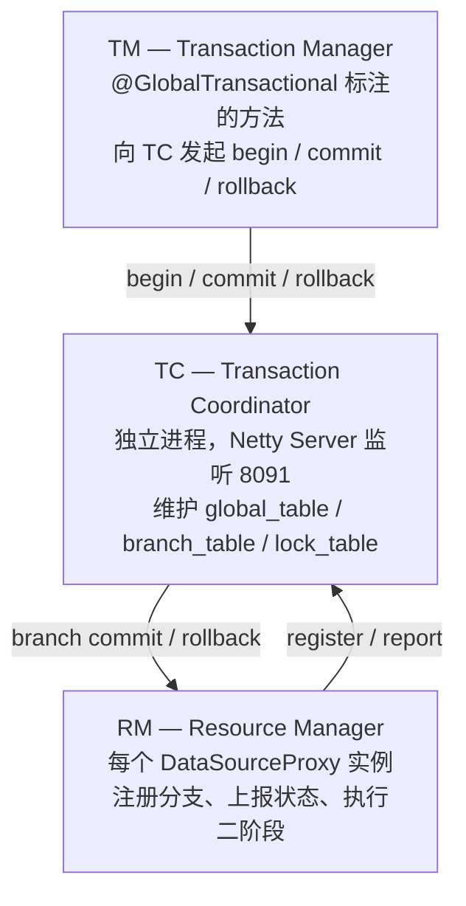
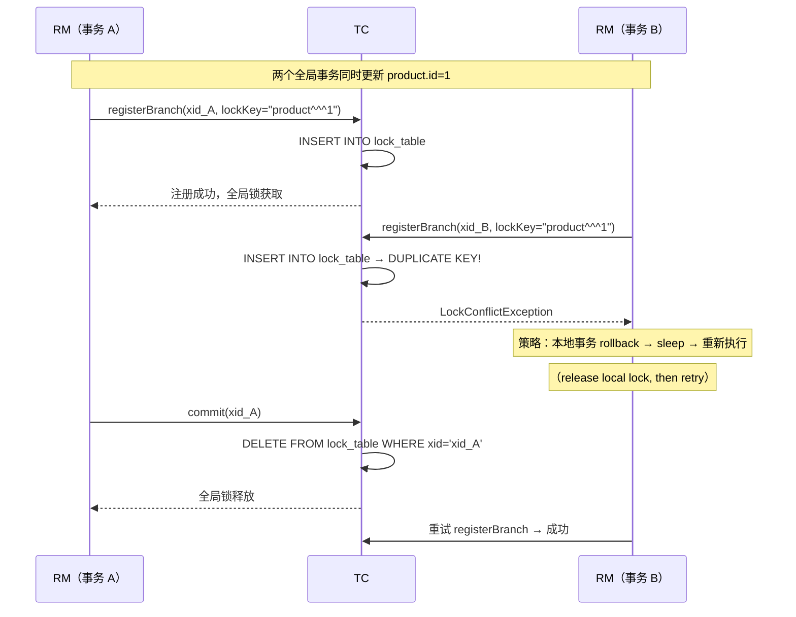
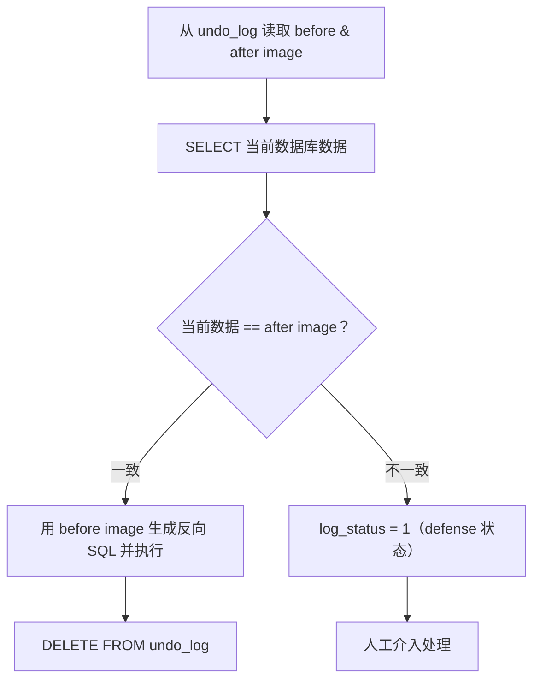
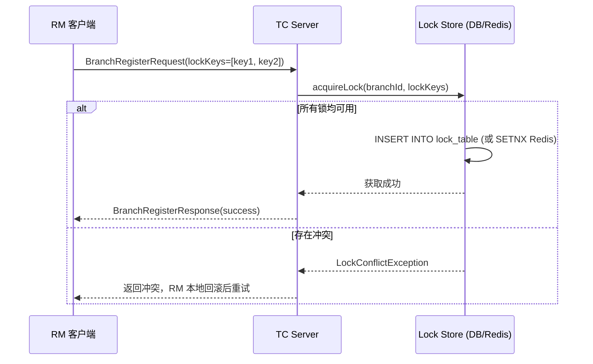

## 3.1 AT 模式实战

### 3.1.1 整体机制

AT 模式是 Seata 独创的无侵入分布式事务解决方案，核心是在数据库层插入代理逻辑。

```
第一阶段：
  1. 解析 SQL，确定操作类型和影响行
  2. 查询前置镜像（Before Image）
  3. 执行业务 SQL
  4. 查询后置镜像（After Image）
  5. 构建回滚日志并插入 UNDO_LOG 表
  6. 向 TC 申请全局锁
  7. 提交本地事务（业务 + UNDO_LOG 在同一个本地事务中）

第二阶段 - 提交：
  收到提交请求 → 放入异步队列 → 立即返回成功 → 后台批量清理 UNDO_LOG

第二阶段 - 回滚：
  收到回滚请求 → 根据 XID + BranchID 查询 UNDO_LOG
  → 验证后置镜像与当前数据一致
  → 根据前置镜像生成补偿 SQL → 执行回滚
```

### 3.1.2 数据源代理

AT 模式要求使用 Seata 提供的 `DataSourceProxy` 包装实际数据源：

```java
// 原生数据源
DataSource ds = new DruidDataSource();
// ... 配置连接信息

// Seata AT 数据源代理
DataSourceProxy dataSourceProxy = new DataSourceProxy(ds);
```

如果使用 Spring Boot，可通过配置自动注入：

```yaml
seata:
  enabled: true
  application-id: applicationName
  tx-service-group: my_test_tx_group
  enable-auto-data-source-proxy: true  # 默认 true，自动代理数据源
```

### 3.1.3 DataSourceProxy 拦截链路

当 Spring 管理的 `DataSource` 被 `DataSourceProxy` 包装后，所有 JDBC 操作的执行路径变为：

```java
// 简化源码路径（io.seata.rm.datasource.DataSourceProxy）
PreparedStatementProxy.executeUpdate()
  → ExecuteTemplate.execute()
    → 1. StatementRecognizer.recognize(sql)     // SQL 识别：INSERT/UPDATE/DELETE
    → 2. BaseTransactionalExecutor.execute()
      → 2a. buildBeforeImage(sql)               // SELECT * FROM table WHERE pk IN (...)
      → 2b. statementCallback.execute(sql)      // 执行原始 SQL
      → 2c. buildAfterImage(pkValues)           // SELECT * FROM table WHERE pk IN (...)
      → 2d. buildUndoItem(beforeImage, afterImage)  // 序列化为 JSON
      → 2e. UndoLogManager.insertUndoLog(undoItem)
      → 2f. ConnectionProxy.commit()            // 提交本地事务（含 UNDO_LOG 写入）
```

**关键设计决策**：
- before image 和 after image 通过**主键**定位，而非原始 WHERE 条件。这避免了二次查询时因条件不精确导致的行集变化。
- UNDO_LOG 与业务 SQL 在**同一个本地事务**中提交——如果 UNDO_LOG 写入失败，整个本地事务回滚，不会产生不一致。
- `only-care-update-columns: true`（2.0+）只记录被更新列的前后值，大幅减少 UNDO_LOG 体积。

### 3.1.4 核心模型源码视角

理解 TC/TM/RM 之间的**通信协议**和**状态流转**，是排查一切生产问题的起点。



- **TC**：独立部署的 Java 进程（`seata-server`），基于 Netty 接收 TM/RM 的 RPC 请求。内部维护三张核心表：`global_table`（全局事务）、`branch_table`（分支事务）、`lock_table`（全局锁）。TC 是**无状态**的（状态存储在 DB 或 Raft Log 中），因此可以水平扩展。
- **TM**：`GlobalTransactionalInterceptor` 拦截 `@GlobalTransactional` 注解的方法，向 TC 发起 begin/commit/rollback。每个全局事务生成一个全局唯一的 **XID**（格式：`ip:port:timestamp`）。
- **RM**：每个 `DataSourceProxy` 实例对应一个 RM。它劫持 JDBC 的 `PreparedStatement.executeUpdate()`，在 SQL 执行前后分别生成 before image 和 after image，并向 TC 注册分支事务。

**TC 通信细节**：TM/RM 与 TC 之间通过 Netty 建立长连接（默认端口 8091），协议采用自定义的 Protobuf 编码。关键设计点：
- **心跳检测**：默认开启，防止连接假死导致事务悬挂
- **Channel 复用**：同一个 JVM 进程中的所有 TM/RM 实例共享一个 Netty Channel 到 TC，减少连接开销
- **批量发送**：`transport.enableTcServerBatchSendResponse(true)` 可解决多个响应串行发送的线头阻塞问题（2.x 建议开启）

### 3.1.5 全局锁与写隔离

```
案例：两个事务 tx1 和 tx2 同时更新 m 字段（原值 1000）

tx1 先到达：
  1. 开始本地事务，获取本地锁
  2. 执行更新：m = 1000 - 100 = 900
  3. 获取全局锁（成功）
  4. 提交本地事务，释放本地锁

tx2 到达：
  1. 开始本地事务，获取本地锁
  2. 执行更新：m = 900 - 100 = 800
  3. 获取全局锁（被 tx1 持有，失败重试）
  4. 重试中...

tx1 执行全局提交，释放全局锁

tx2 获取全局锁成功，提交本地事务
```

AT 模式的写隔离依赖 TC 的 `lock_table`。每次分支注册时，RM 上报本次修改的**表名 + 主键值**作为 lock key。

```sql
-- TC 端的 lock_table 结构
CREATE TABLE `lock_table` (
  `row_key` VARCHAR(128) NOT NULL,      -- 格式: {resourceId}^^^{tableName}^^^{pk}
  `xid` VARCHAR(128) NOT NULL,
  `branch_id` BIGINT NOT NULL,
  `table_name` VARCHAR(32),
  `pk` VARCHAR(36),
  PRIMARY KEY (`row_key`)
);
```

**全局锁的生命周期**：



**关键规则**：
- 提交本地事务**之前**必须先获取到全局锁
- 获取全局锁失败则不断重试（有超时限制）
- 超时未获取到全局锁 → 回滚本地事务，释放本地锁
- 回滚阶段若本地锁被其他事务持有 → 重试获取本地锁

**为什么一阶段要先释放本地锁再获取全局锁？** 如果 RM2 持有行锁的同时等待全局锁，而 RM1 回滚时需要行锁来执行反向 SQL，就会形成**跨层死锁**。Seata 的策略是：全局锁获取失败后，**立刻回滚本地事务、释放行锁**，然后轮询重试。

重试机制的核心参数：
- `client.rm.lock.retry-interval`：重试间隔（默认 10ms）
- `client.rm.lock.retry-times`：重试次数（默认 30 次）
- 总等待窗口：30 × 10ms = **300ms**，超过则抛 `LockConflictException`

**生产建议**：对于热点数据（如秒杀库存扣减），300ms 往往不够。但盲目增大重试次数会导致请求堆积。更好的解法是：业务层面拆分热点（如库存分片），或在 TM 层对全局事务做并发控制。

### 3.1.6 读隔离

AT 模式默认工作在 **READ UNCOMMITTED** 级别。原因：一阶段已提交本地事务，数据已写盘，但全局事务可能尚未最终提交（二阶段异步执行中），其他事务此时读到该数据即为"脏读"。

**两种隔离升级方案**：

| 方案 | 机制 | 成本 | 适用场景 |
|------|------|------|----------|
| `@GlobalLock` | 读前向 TC 检查全局锁，有锁则等待 | 仅一次 RPC，约 2ms 延迟 | 纯读路径，避免脏读 |
| `SELECT FOR UPDATE` | 先等全局锁释放，再获取本地行锁 | 行锁持有至事务结束 | 读后写路径，需要 REPEATABLE READ |

```java
// @GlobalLock：纯读接口，避免读到未提交的全局事务数据
@GlobalLock
@Transactional(readOnly = true)
public ProductDTO query(Long id) {
    return productMapper.selectById(id);
}

// SELECT FOR UPDATE：读后写路径，Seata 代理了 FOR UPDATE
@GlobalTransactional
public void deductStock(Long id, Integer qty) {
    Stock stock = stockMapper.selectForUpdate(id);  // 自动检查全局锁
    if (stock.getCount() < qty) throw new RuntimeException("库存不足");
    stockMapper.deduct(id, qty);
}
```

**@GlobalLock 的局限**：
1. 只能保证单行"当前已提交"，不能跨行保证一致性——A+B 总和的约束无法在 @GlobalLock 层面保障
2. 不能保证 REPEATABLE READ——两次 `@GlobalLock` 之间，数据可能被其他事务修改
3. 仅对本地 SQL 生效，无法影响远程服务的读取

> 出于性能考虑，Seata 只代理 `SELECT FOR UPDATE` 语句，普通 `SELECT` 不做代理。

### 3.1.7 AT 模式的使用场景与限制

**适用场景**：
- 单体应用平移到微服务架构，希望最低改造成本
- 使用关系型数据库（MySQL、PostgreSQL、Oracle 等）
- 业务逻辑通过 JDBC 访问数据库

**限制**：
- 仅支持关系型数据库
- 不适用于非 JDBC 数据源（如 Redis、MongoDB）
- 大事务下 UNDO_LOG 可能较大

### 3.1.8 脏写检测机制

Seata 在回滚时会校验数据是否被其他事务"脏写"，以决定能否安全回滚。

**脏写检测流程**：



**脏写的根本原因**：有代码绕过了 `DataSourceProxy` 直接操作数据库。典型场景：
- 定时任务使用独立的未代理 DataSource
- DBA 手动执行 UPDATE
- 批处理程序使用独立连接池

**防御策略**：
- TC 端配置 `server.undo.logSaveDays=7`，保留 defense 记录 7 天
- 监控 `undo_log WHERE log_status=1` 的数量并告警
- 审计所有数据库连接，确保都经过 DataSourceProxy

### 3.1.10 全局锁底层技术实现

#### 3.1.10.1 Lock Key 的生成规则

全局锁的最小粒度是**单行记录**，Lock Key 由三部分组成：

```
lockKey = resourceId + "^^^" + tableName + "^^^" + pkValue
```

- `resourceId`：JDBC URL（如 `jdbc:mysql://127.0.0.1:3306/order_db`），用于区分不同数据库实例
- `tableName`：被操作的表名
- `pkValue`：主键值（复合主键用逗号拼接，如 `1,2`）

**示例**：
```
jdbc:mysql://127.0.0.1:3306/order_db^^^t_order^^^1001
```

RM 在执行 `UPDATE t_order SET status=1 WHERE id=1001` 时，SQL 解析器提取 WHERE 条件中的主键值，构建 lockKey 上报给 TC。

#### 3.1.10.2 TC 端全局锁的获取流程



TC 端的核心逻辑在 `AbstractLockManager.acquireLock()`：

```java
// 简化伪代码（io.seata.server.lock.AbstractLockManager）
public boolean acquireLock(BranchDO branch) {
    String dbKey = branch.getResourceId();
    List<LockDO> locks = convertToLockDO(branch);
    
    // 1. 检查当前分支是否已持有该锁（可重入）
    List<LockDO> existing = lockStore.queryLocks(locks);
    if (isOwnedByCurrentBranch(existing, branch)) {
        return true;  // 可重入，直接返回
    }
    
    // 2. 检查是否有其他分支持有
    if (isHeldByOtherBranch(existing)) {
        throw new LockConflictException("Global lock occupied");
    }
    
    // 3. 插入锁记录（DB模式走 INSERT，Redis模式走 SETNX）
    lockStore.insertLock(locks);
    return true;
}
```

**关键设计**：
- **可重入性**：同一分支事务多次修改同一行，不会死锁
- **原子性**：多个 lockKey 的获取是原子操作，要么全成功，要么全失败
- **DB 模式**：依赖 `row_key` 的唯一索引，INSERT 冲突即表示锁被占用
- **Redis 模式**：使用 `SETNX` + Lua 脚本保证原子性，性能更高

#### 3.1.10.3 全局锁的存储模式对比

| 维度 | File 模式 | DB 模式 | Redis 模式 |
|------|-----------|---------|------------|
| 适用场景 | 开发/测试 | 生产（中小规模） | 生产（高并发） |
| 并发能力 | 单节点，无并发 | 依赖 DB 连接池 | 单实例 10w+ QPS |
| 持久化 | 内存，重启丢失 | 持久化到 MySQL | RDB/AOF 可选 |
| 集群支持 | ❌ | ✅（需共享 DB） | ✅（Redis Cluster） |
| 锁超时清理 | 无 | TC 定时任务扫描 | Redis TTL 自动过期 |

**生产推荐**：`--storeMode db --lockMode redis`，事务日志走 DB 保证持久化，全局锁走 Redis 保证性能。

#### 3.1.10.4 全局锁的释放时机

全局锁在以下场景被释放：

| 场景 | 触发方 | 释放时机 |
|------|--------|----------|
| 全局提交 | TC | 二阶段提交完成后，异步删除 lock_table |
| 全局回滚 | TC | 二阶段回滚完成后，立即删除 lock_table |
| 事务超时 | TC | TimeoutCheck 线程扫描超时事务，主动回滚并释放锁 |
| RM 异常断开 | TC | 心跳检测失败，清理该 RM 持有的所有锁 |

```sql
-- TC 端释放锁的 SQL（DB 模式）
DELETE FROM lock_table 
WHERE xid = ? AND branch_id = ?;

-- Redis 模式：删除对应的 Hash Key
DEL seata:lock:{xid}:{branchId}
```

#### 3.1.10.5 全局锁与本地锁的协调（防死锁设计）

Seata 采用**先本地后全局，冲突释放本地**的策略避免跨层死锁：

```
正常流程：
  1. 获取本地行锁（数据库 InnoDB 行锁）
  2. 执行 SQL，生成 undo_log
  3. 向 TC 申请全局锁
  4. 获取成功 → 提交本地事务 → 释放本地锁 + 保持全局锁
  5. 获取失败 → 回滚本地事务 → 释放本地锁 → sleep → 重试步骤 3

死锁场景（如果设计不当）：
  TX1: 持有本地锁A，等待全局锁B
  TX2: 持有本地锁B，等待全局锁A
  → 跨层死锁，数据库和 TC 都无法感知

Seata 的解法：
  全局锁获取失败 → 立刻回滚本地事务 → 打破死锁条件
```

### 3.1.11 AT 模式实战问题

#### 3.1.11.1 全局锁冲突（LockConflictException）

**现象**：
```
io.seata.rm.datasource.exec.LockConflictException: 
  get global lock fail, lockKeys: jdbc:mysql://127.0.0.1:3306/db^^^t_product^^^1
```

**根因分析**：

| 原因 | 排查方法 | 解决方案 |
|------|----------|----------|
| 热点行并发更新 | 查 `lock_table` 中 row_key 对应的 xid | 业务层拆分热点（库存分片） |
| 全局事务跨度过长 | 查 `global_table` 中 begin_time 距今时长 | 将非核心操作移出 `@GlobalTransactional` |
| 重试参数过小 | 检查 `client.rm.lock.retry-times` | 适当增大（但注意请求堆积风险） |
| TC 宕机导致锁未释放 | 查 TC 日志和 `lock_table` 残留记录 | 手动清理残留锁记录 |

**诊断 SQL**：
```sql
-- 查看当前持有的全局锁
SELECT l.row_key, l.xid, l.branch_id, l.table_name, l.pk,
       g.gmt_create AS global_tx_begin,
       TIMESTAMPDIFF(SECOND, g.gmt_create, NOW()) AS hold_seconds
FROM lock_table l
LEFT JOIN global_table g ON l.xid = g.xid
WHERE l.table_name = 't_product'
ORDER BY g.gmt_create;

-- 查看超时的全局事务（超过 60s 未提交）
SELECT xid, status, gmt_create, application_id
FROM global_table 
WHERE status = 1  -- Begin 状态
  AND TIMESTAMPDIFF(SECOND, gmt_create, NOW()) > 60;
```

#### 3.1.11.2 UNDO_LOG 膨胀

**现象**：`undo_log` 表占用空间持续增长，二阶段提交后未清理。

**根因**：

| 原因 | 说明 |
|------|------|
| TC 宕机 | 二阶段提交指令未送达，UNDO_LOG 残留 |
| 网络分区 | RM 与 TC 之间网络中断，异步清理失败 |
| 脏写（log_status=1） | 回滚时发现数据已被修改，标记为 defense 状态 |

**治理方案**：
```sql
-- 定期清理已提交的 undo_log（TC 正常时自动清理，此为兜底）
DELETE FROM undo_log 
WHERE log_status = 0 
  AND gmt_create < DATE_SUB(NOW(), INTERVAL 1 DAY);

-- 监控脏写记录
SELECT xid, branch_id, table_name, log_created
FROM undo_log 
WHERE log_status = 1 
ORDER BY log_created DESC LIMIT 20;
```

**预防**：
- 开启 `only-care-update-columns: true` 减少单条 undo_log 体积
- 定期监控 `undo_log` 表大小，设置告警阈值
- 审计所有数据库连接，确保无绕过 `DataSourceProxy` 的直连

#### 3.1.11.3 XID 传播丢失

**现象**：
```
Could not found global transaction xid = xxx
io.seata.core.exception.TransactionException: Could not register branch
```

**根因**：XID 未在微服务间正确传递，分支事务无法关联到全局事务。

**传播链路**：
```
TM（发起方）                    RM（参与方）
  │                               │
  ├─ RootContext.bind(xid)        │
  ├─ RPC 调用（Feign/Dubbo）      │
  │   └─ XID 放入 RPC Context     │
  │                               ├─ RPC Context 提取 XID
  │                               ├─ RootContext.bind(xid)
  │                               └─ 执行本地 SQL（自动注册分支）
```

**排查 Checklist**：
1. Feign 是否配置了 `SeataFeignClient` 或 `SeataFeignRequestInterceptor`？
2. Dubbo 是否引入了 `seata-dubbo` 依赖（自动通过 Filter 传递 XID）？
3. 异步线程池是否传递了 XID？（`RootContext` 基于 `ThreadLocal`，跨线程需手动传递）
4. MQ 消费端是否从 Message Header 中提取了 XID？

**异步场景修复**：
```java
// 错误：ThreadLocal 无法跨线程
@GlobalTransactional
public void asyncProcess() {
    executor.submit(() -> {
        // 这里 RootContext.getXID() 为 null！
        orderMapper.updateStatus(id, 1);
    });
}

// 正确：手动传递 XID
@GlobalTransactional
public void asyncProcess() {
    String xid = RootContext.getXID();
    executor.submit(() -> {
        RootContext.bind(xid);  // 绑定到子线程
        try {
            orderMapper.updateStatus(id, 1);
        } finally {
            RootContext.unbind();  // 清理
        }
    });
}
```

#### 3.1.11.4 长事务导致的锁持有

**现象**：全局事务包含外部 HTTP 调用或人工审批，耗时数秒到数分钟，期间全局锁一直被持有，其他事务无法更新相关行。

**解决方案**：

| 方案 | 适用场景 | 实现方式 |
|------|----------|----------|
| 缩短事务边界 | 外部调用可移出事务 | 先执行外部调用，再开启 `@GlobalTransactional` |
| 改用 Saga 模式 | 长流程业务（审批流） | 使用 `StateMachineEngine` 编排 |
| 业务层并发控制 | 无法缩短事务 | 用分布式锁或队列串行化 |

```java
// 错误：外部调用在事务内
@GlobalTransactional
public void createOrder(OrderDTO dto) {
    // 1. 本地 DB 操作（持有全局锁）
    orderMapper.insert(order);
    
    // 2. 外部 HTTP 调用（耗时 3s，锁一直被持有！）
    paymentClient.pay(dto.getPaymentInfo());
    
    // 3. 本地 DB 操作
    stockMapper.deduct(dto.getProductId(), dto.getQty());
}

// 正确：外部调用移出事务
public void createOrder(OrderDTO dto) {
    // 1. 先执行外部调用
    paymentClient.pay(dto.getPaymentInfo());
    
    // 2. 再开启全局事务（锁持有时间最短）
    doCreateOrder(dto);
}

@GlobalTransactional
private void doCreateOrder(OrderDTO dto) {
    orderMapper.insert(order);
    stockMapper.deduct(dto.getProductId(), dto.getQty());
}
```

#### 3.1.11.5 分库分表兼容性问题

> 详细指南见专题文章：<a href="#/article/distributed/seata-shardingsphere-guide">Seata AT 模式与 ShardingSphere 分库分表集成实战</a>

**现象**：使用 ShardingSphere 分库分表后，Seata AT 模式出现 `Cannot find table meta` 或 undo_log 生成失败。

**根因**：Seata 的 SQL 解析器需要获取表结构元数据（主键、列类型），分库分表场景下表名被改写（如 `t_order` → `t_order_01`），导致元数据查找失败。更本质的原因是**数据源代理链**的编排错误。

**快速诊断 checklist**：

| 问题 | 排查点 |
|------|--------|
| UNDO_LOG 为空 | 检查 `enable-auto-data-source-proxy` 是否为 `false`，确认 DataSourceProxy 包的是物理 DataSource |
| 元数据异常 | 设置 `table-meta-checker-enable: false` |
| UNDO_LOG 路由异常 | 将 `undo_log` 配置为广播表 |
| 分支事务注册失败 | 检查 ShardingSphere 分片执行线程的 XID 传递 |

**包装顺序**（关键）：
```
物理DataSource → Seata DataSourceProxy → ShardingSphereDataSource
```

这是与直觉相反的代理顺序——`DataSourceProxy` 必须包装物理 DataSource，而非包装 `ShardingSphereDataSource`。详见专题文章中的"数据源编排"章节。

#### 3.1.11.6 性能调优建议

| 调优项 | 默认值 | 推荐值 | 说明 |
|--------|--------|--------|------|
| `client.rm.async-commit-buffer-limit` | 10000 | 10000 | 二阶段提交异步缓冲，无需调整 |
| `client.rm.lock.retry-interval` | 10ms | 10-50ms | 热点场景可适当增大间隔 |
| `client.rm.lock.retry-times` | 30 | 30-100 | 根据业务容忍度调整 |
| `client.rm.report-success-enable` | true | **false** | 不上报分支成功，减少 RPC 开销 |
| `transport.enableTcServerBatchSendResponse` | false | **true** | 批量发送响应，减少线头阻塞 |
| `undo.logSaveDays` | 7 | 3-7 | 根据审计需求调整 |

### 3.1.9 AT 模式的 SQL 限制

| 限制 | 说明 | 替代方案 |
|------|------|----------|
| 不支持存储过程/触发器 | Seata 无法解析内部 SQL | 改为应用层代码 |
| 不支持多表复杂 JOIN | 部分版本不支持 `UPDATE t1 JOIN t2` | 拆分为单表操作 |
| 不支持 SQL 嵌套 | 子查询中的 UPDATE 等 | 改写 SQL |
| 批量更新 | MySQL/MariaDB/PostgreSQL9.6+ 支持 `jdbcTemplate.batchUpdate` | 使用支持的 API |
| 跨库操作 | `DataSourceProxy` 只能代理一个 DataSource，跨库需多个 RM | 应用层聚合或改用 TCC/SAGA |

