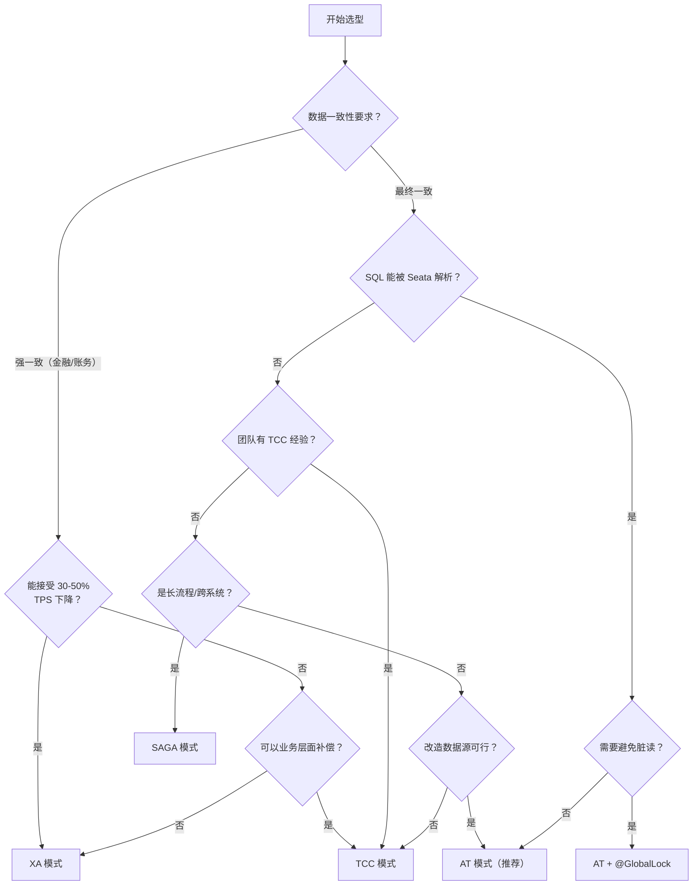

> **版本**: v2.6 | **适用对象**: Java 微服务开发者  
> **官方地址**: https://seata.apache.org/ | **GitHub**: https://github.com/apache/incubator-seata

---

## 1.1 Seata 是什么

Seata（Simple Extensible Autonomous Transaction Architecture）是 **Apache 基金会**旗下的开源分布式事务解决方案，致力于提供高性能、易用的分布式事务服务。

### 1.1.1 发展历程

- 内部代号 **TXC**（Taobao Transaction Constructor），起源于阿里巴巴的"五彩石"项目
- 早期在阿里巴巴内部支撑了数千个核心业务系统
- 逐步演进为开源项目，现已成为 Apache 孵化器项目
- 已被中信银行、光大银行等金融机构的核心账务系统采用

### 1.1.2 核心价值

| 特性 | 说明 |
|------|------|
| **高性能** | 单节点理论极限约 3 万 TPS，10 万 QPS |
| **零侵入（AT 模式）** | 对业务代码几乎无侵入，仅需一个注解 |
| **多模式支持** | AT、TCC、Saga、XA 四种模式全覆盖 |
| **生态丰富** | 已集成 10+ 主流 RPC 框架和关系型数据库 |
| **可扩展** | 微内核 + 插件架构，扩展点覆盖注册中心、配置中心、存储模式、锁控制、SQL 解析器等 |

### 1.1.3 分布式事务的"不可能三角"

微服务架构拆分了数据源，原本一个 `@Transactional` 解决的问题，变成跨数据库、跨服务的协调难题。在选型之前，先理解分布式事务领域的约束：

| 约束 | 说明 |
|------|------|
| **ACID 无法跨网络** | 数据库的 ACID 依赖单机锁和 WAL，跨网络后既不共享锁也不共享日志 |
| **CAP 的现实含义** | 网络分区时，一致性和可用性无法兼得——但 CAP 说的是极端情况，正常运行时两者可以兼得 |
| **性能不是免费的** | 每多一层协调（全局锁、二阶段、UNDO_LOG），就多一层延迟。没有"既快又强一致"的通用方案 |

业界常见方案的对比：

| 方案 | 核心思想 | 一致性 | 性能 | 适用场景 |
|------|----------|--------|------|----------|
| 本地消息表 + 定时补偿 | 业务方轮询补偿 | 最终 | 中 | 非实时对账、跨系统通知 |
| RocketMQ 事务消息 | 半消息 + 回查，MQ 保证投递 | 最终 | 高 | 异步解耦 + 事务投递 |
| TCC | 业务方实现 Try/Confirm/Cancel | 最终 | 高 | 核心交易链路 |
| Seata AT | DataSource 代理 + UNDO_LOG | 最终（可升级） | 高 | 无侵入改造项目 |

Seata 的核心价值在于：将分布式事务的协调复杂度从业务代码中剥离，由中间件层统一处理。但要真正用好它，必须理解底层机制而非仅仅"会用注解"。

---

## 1.2 核心概念

### 1.2.1 三大核心组件

```
┌──────────────┐
│     TC       │  ← Transaction Coordinator（事务协调器）
│  (Server)    │     维护全局事务状态，驱动分支事务的提交/回滚
└──────┬───────┘
       │
┌──────┴───────┐          ┌──────────────┐
│     TM       │─────────▶│     RM       │
│  Transaction │ 开启/结束 │  Resource    │
│   Manager    │ 全局事务  │   Manager    │
│  (Client)    │          │  (Client)    │
└──────────────┘          └──────────────┘
                             管理分支事务
                             处理本地资源
```

- **TC (Transaction Coordinator)** — 事务协调器，独立部署的 Server 端。维护全局事务的运行状态，负责协调分支事务的提交或回滚。
- **TM (Transaction Manager)** — 事务管理器，嵌入在应用中的 Client 端。通过 `@GlobalTransactional` 注解开启、提交或回滚全局事务。
- **RM (Resource Manager)** — 资源管理器，嵌入在应用中的 Client 端。管理分支事务处理的资源，向 TC 注册分支事务并汇报状态。

### 1.2.2 关键术语

| 术语 | 说明 |
|------|------|
| **全局事务 (Global Transaction)** | 由 TM 开启的一个分布式事务，包含多个分支事务 |
| **分支事务 (Branch Transaction)** | 一个微服务中独立执行的本地事务，是全局事务的组成部分 |
| **XID** | 全局事务的唯一标识，在微服务调用链中透传 |
| **二阶段提交 (2PC)** | Seata 各事务模式均基于 2PC 演变而来 |

### 1.2.3 事务分组 (Transaction Group)

事务分组是 Seata 的逻辑隔离机制。每个微服务通过配置 `tx-service-group` 映射到 TC 集群，实现：

- 环境隔离（开发/测试/生产使用不同分组）
- 多集群支持
- 动态切换 TC（故障转移）

### 1.2.4 XID 的传播机制

XID 是串联整个调用链的唯一标识。TM 向 TC 申请 XID 后，必须通过 RPC 调用链传递到下游服务。

Seata 在主流框架中的穿透方式：

| 框架 | 传播机制 | 实现类 |
|------|----------|--------|
| Dubbo | `RpcContext.getClientAttachment()` | `SeataDubboFilter`（provider/consumer 双向 Filter，自动处理） |
| Spring Cloud OpenFeign | Header 注入 | `SeataFeignClientAutoConfiguration` 自动注册 RequestInterceptor |
| gRPC | Context metadata | 客户端 interceptor + 服务端 interceptor |
| RestTemplate | Header 注入 | `SeataRestTemplateInterceptor` |

**核心原理**：Seata 的 XID 传播依赖 `RootContext`（基于 ThreadLocal）。每个线程在进入 TM 方法时绑定 XID，退出时解绑。涉及异步调用时需要特别注意。

**生产排查经验**：如果日志中出现 `Could not found global transaction xid = xxx`，优先检查三点：
1. 异步线程是否通过 `RootContext.bind(xid)` 手动绑定了 XID
2. 自定义 RPC 框架是否在 header 中传递了 `TX_XID`
3. 配置中心的 `service.vgroupMapping` 是否一致（不同分组的 TC 集群不共享事务状态）

---

## 1.3 四大事务模式对比

Seata 提供四种事务模式，按**对业务的侵入性**和**底层依赖**排列如下：

### 1.3.1 AT 模式（Automatic Transaction）

**核心思想**：基于**关系型数据库**本地 ACID 事务 + JDBC 代理，自动生成回滚 SQL。

```
第一阶段（Prepare）
┌────────────────────────────────────────────┐
│  1. 解析 SQL，生成前置镜像（Before Image）    │
│  2. 执行业务 SQL                            │
│  3. 查询后置镜像（After Image）              │
│  4. 将前后镜像构建回滚日志（UNDO_LOG）        │
│  5. 申请全局锁                              │
│  6. 提交本地事务（业务 SQL + UNDO_LOG 同事务） │
└────────────────────────────────────────────┘

第二阶段（Commit / Rollback）
┌─ 提交：异步清理 UNDO_LOG（立即返回成功） ─┐
│  │                                          │
└─ 回滚：根据 UNDO_LOG 的前置镜像自动生成       ┘
         补偿 SQL 并执行
```

**前提条件**：
- 数据库必须支持本地 ACID 事务（如 MySQL InnoDB）
- 应用通过 JDBC 访问数据库

**优势**：业务代码零侵入，同一数据源内透明。
**劣势**：依赖数据库特性，不支持非关系型数据库。

### 1.3.2 TCC 模式（Try-Confirm-Cancel）

**核心思想**：将分支事务的二阶段行为交由**业务代码自定义**，不依赖底层数据库。

```
TCC 三阶段
┌──────────────────────────────────────────────────┐
│  Try    → 预留资源（冻结库存、冻结资金）            │
│  Confirm → 执行业务（真正扣减）                    │
│  Cancel  → 释放资源（解冻库存、解冻资金）           │
└──────────────────────────────────────────────────┘
```

**优势**：
- 不依赖数据库事务支持
- 资源锁定粒度可自定义，锁持有时间短
- 适合跨服务、跨数据库场景

**劣势**：
- 业务侵入性强，需实现 Try/Confirm/Cancel 三个方法
- 需自行处理幂等、空回滚、防悬挂问题

### 1.3.3 Saga 模式

**核心思想**：每个参与者直接提交本地事务，若后续环节失败，则对已成功的参与者执行**补偿**操作。

```
正向流程：  服务A ──▶ 服务B ──▶ 服务C ──▶ 成功
补偿流程：  服务A ◀── 服务B ◀── 服务C 失败
           (补偿)    (补偿)
```

**理论基础**：Hector & Kenneth 1987 年论文《Sagas》

**优势**：
- 一阶段提交，无锁，高性能
- 事件驱动架构，参与者可异步执行，高吞吐
- 适合长业务流程（如审批流、订单全流程）

**劣势**：
- 不保证隔离性，需业务层处理脏写
- 补偿逻辑需要手动实现

### 1.3.4 XA 模式

**核心思想**：基于 X/Open XA 规范，利用数据库对 XA 协议的原生支持实现分布式事务。

**实现方式**：Seata 通过 `DataSourceProxy` 对 XA 连接进行代理，将 Seata 全局事务的 XID 映射为 XA 分支事务的 Xid。

**优势**：
- 真正的全局一致性，强 ACID
- 数据库层面保证隔离性
- 对业务代码无侵入（同 AT 模式）

**劣势**：
- 性能相对较低（XA 协议本身开销）
- 依赖数据库对 XA 协议的支持
- 锁持有时间长

### 1.3.5 选型建议

| 场景 | 推荐模式 | 原因 |
|------|----------|------|
| 单体应用拆分初期 | **AT** | 零侵入，最低改造成本 |
| 高并发、短事务 | **AT / TCC** | 性能好，资源锁快 |
| 跨公司、跨遗留系统 | **Saga** | 无需三方接口，补偿灵活 |
| 金融核心、强一致 | **XA** | 真正的全局一致性 |
| 长链路、异步流程 | **Saga** | 事件驱动，吞吐量高 |
| 需要精确控制锁粒度 | **TCC** | 业务自定义资源预留 |

### 1.3.6 选型决策树



### 1.3.7 四种模式全景对比

| 维度 | AT | XA | TCC | SAGA |
|------|----|----|-----|------|
| 代码侵入 | 无 | 无 | 高（3 方法 + 状态管理） | 中（JSON 定义） |
| 一致性 | 最终一致（可升级） | 强一致 | 最终一致 | 最终一致 |
| 性能损失 | 约 5-10% | 30-70%（锁持有） | 约 10% | 取决于步骤数 |
| 隔离性 | READ UNCOMMITTED（默认） | 数据库原生 | 业务自定义 | 无隔离 |
| 回滚 | 自动（反向 SQL） | 自动（XA ROLLBACK） | 手动（Cancel） | 手动（Compensation） |
| DB 要求 | UNDO_LOG 表 | XA 协议 | 无 | 无 |
| SQL 限制 | 不支持存储过程/触发器 | 无 | 无 | 无 |
| 运维成本 | 低 | 低 | 高（TCC 逻辑维护） | 中（状态机维护） |

---

## 1.4 分布式事务理论基础

### 1.4.1 CAP 定理

- **一致性 (Consistency)**：所有节点同一时刻看到相同数据
- **可用性 (Availability)**：每个请求都能获得正常响应
- **分区容忍性 (Partition Tolerance)**：网络分区时系统仍能运行

分布式系统中，P 是必选项，需在 C 和 A 之间权衡。Seata 的 AT 模式偏向 **CP**（牺牲部分可用性换取一致性），Saga 模式偏向 **AP**（最终一致性）。

### 1.4.2 BASE 理论

- **基本可用 (Basically Available)**：允许部分功能不可用
- **软状态 (Soft State)**：允许中间状态
- **最终一致性 (Eventually Consistent)**：经过一段时间后数据一致

Seata 的 Saga 模式即是典型的 BASE 思想实现。

### 1.4.3 二阶段提交协议 (2PC)

Seata 的四种模式均是 2PC 的变体：

| 模式 | 第一阶段 | 第二阶段提交 | 第二阶段回滚 |
|------|----------|-------------|-------------|
| **AT** | 业务 SQL + UNDO_LOG 同事务提交 | 异步清理 UNDO_LOG | 自动根据 UNDO_LOG 补偿 |
| **TCC** | 调用 Try 预留资源 | 调用 Confirm | 调用 Cancel |
| **Saga** | 提交本地事务 | —（正向已完成） | 执行补偿逻辑 |
| **XA** | XA Prepare | XA Commit | XA Rollback |

