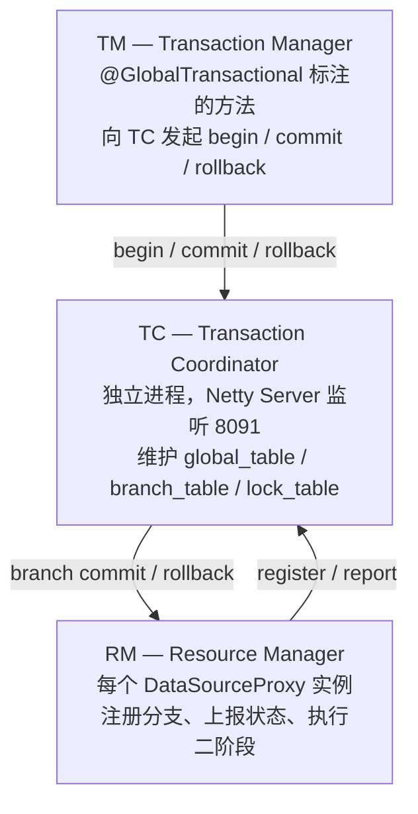
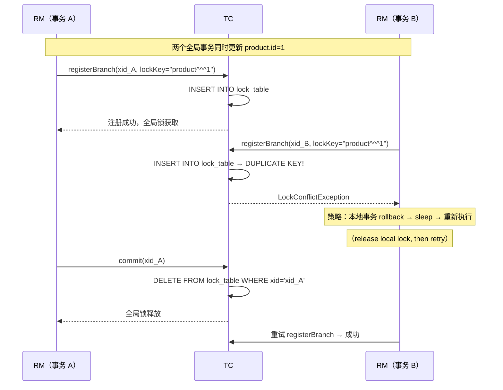
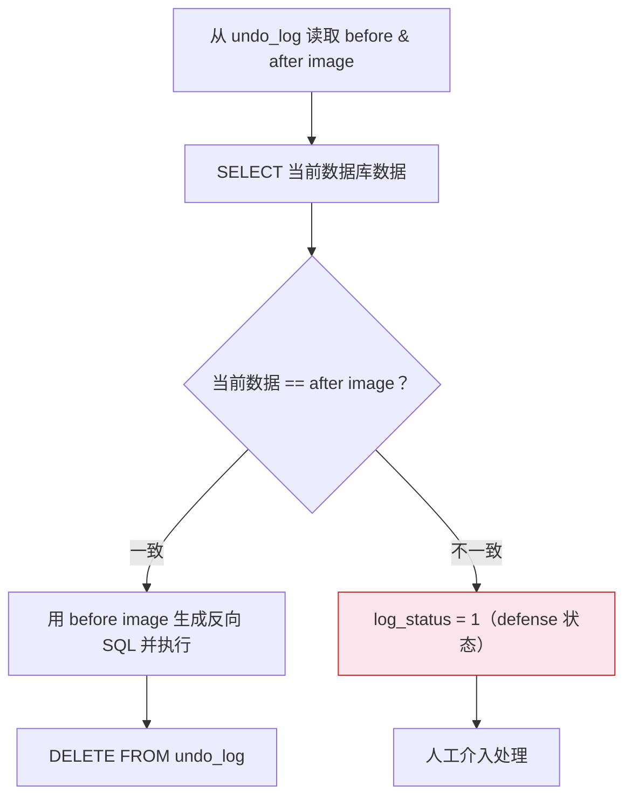
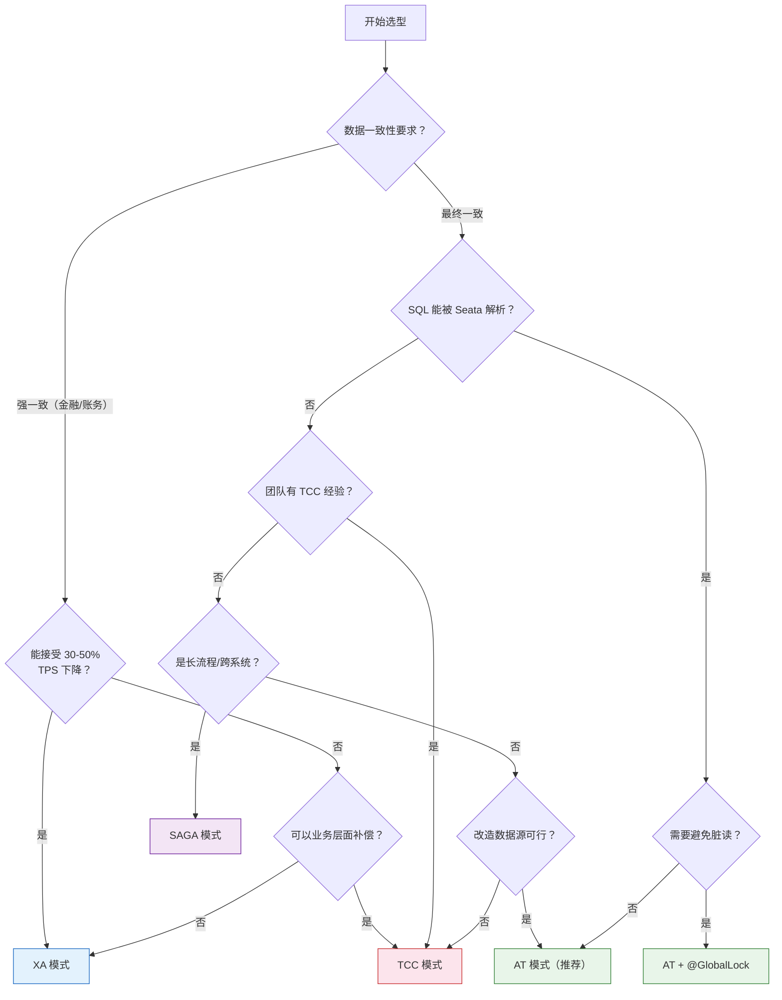

## 一、Seata 的定位与核心价值

### 1.1 分布式事务的"不可能三角"

微服务架构拆分了数据源，原本一个 `@Transactional` 解决的问题，变成跨数据库、跨服务的协调难题。在选型之前，先理解分布式事务领域的约束：

| 约束 | 说明 |
|------|------|
| **ACID 无法跨网络** | 数据库的 ACID 依赖单机锁和 WAL，跨网络后既不共享锁也不共享日志 |
| **CAP 的现实含义** | 网络分区时，一致性（所有节点看到同一数据）和可用性（每个请求都得到响应）无法兼得 — 但 CAP 说的是极端情况，正常运行时两者可以兼得 |
| **性能不是免费的** | 每多一层协调（全局锁、二阶段、undo log），就多一层延迟。没有"既快又强一致"的通用方案 |

业界常见方案的对比：

| 方案 | 核心思想 | 一致性 | 性能 | 适用场景 |
|------|----------|--------|------|----------|
| 本地消息表 + 定时补偿 | 业务方轮询补偿 | 最终 | 中 | 非实时对账、跨系统通知 |
| RocketMQ 事务消息 | 半消息 + 回查，MQ 保证投递 | 最终 | 高 | 异步解耦 + 事务投递 |
| TCC | 业务方实现 Try/Confirm/Cancel | 最终 | 高 | 核心交易链路 |
| Seata AT | DataSource 代理 + undo log | 最终（可升级） | 高 | 无侵入改造项目 |

### 1.2 Seata 的历史与定位

Seata 是**阿里巴巴与蚂蚁金服联合开源**的分布式事务中间件，前身是阿里巴巴的 **Fescar**（Fast & Easy Commit And Rollback）。2019 年进入 Apache 孵化器，当前稳定版本 **v2.6**（2025）。

Seata 的核心价值在于：将分布式事务的协调复杂度从业务代码中剥离，由中间件层统一处理。但要真正用好它，必须理解底层机制而非仅仅"会用注解"。本文侧重源码级原理、生产故障排查和架构决策，适合有分布式系统经验的后端工程师。

---

## 二、核心模型：TC / TM / RM 三角色

Seata 的三个角色构成经典分布式事务模型。理解它们之间的**通信协议**和**状态流转**，是排查一切生产问题的起点。

### 2.1 角色定义（源码视角）



- **TC**：独立部署的 Java 进程（`seata-server`），基于 Netty 接收 TM/RM 的 RPC 请求。内部维护三张核心表：`global_table`（全局事务）、`branch_table`（分支事务）、`lock_table`（全局锁）。TC 是**无状态**的（状态存储在 DB 或 Raft Log 中），因此可以水平扩展。
- **TM**：`GlobalTransactionalInterceptor` 拦截 `@GlobalTransactional` 注解的方法，向 TC 发起 begin/commit/rollback。每个全局事务生成一个全局唯一的 **XID**（格式：`ip:port:timestamp`）。
- **RM**：每个 `DataSourceProxy` 实例对应一个 RM。它劫持 JDBC 的 `PreparedStatement.executeUpdate()`，在 SQL 执行前后分别生成 before image 和 after image，并向 TC 注册分支事务。

### 2.2 XID 的传播机制

XID 是串联整个调用链的唯一标识。TM 向 TC 申请 XID 后，必须通过 RPC 调用链传递到下游服务。

**Seata 在主流框架中的穿透方式**：

| 框架 | 传播机制 | 实现类 |
|------|----------|--------|
| Dubbo | `RpcContext.getClientAttachment()` | `SeataDubboFilter`（provider/consumer 双向 Filter，自动处理） |
| Spring Cloud OpenFeign | Header 注入 | `SeataFeignClientAutoConfiguration` 自动注册 RequestInterceptor |
| gRPC | Context metadata | 客户端 interceptor + 服务端 interceptor |
| RestTemplate | Header 注入 | `SeataRestTemplateInterceptor` |

**核心原理**：Seata 的 XID 传播依赖 `RootContext`（基于 ThreadLocal）。每个线程在进入 TM 方法时绑定 XID，退出时解绑。涉及异步调用时需要特别注意。

**生产排查经验**：如果日志中出现 `Could not found global transaction xid = xxx`，优先检查三点：
1. 异步线程是否通过 `RootContext.bind(xid)` 手动绑定了 XID
2. 自定义 RPC 框架是否在 header 中传递了 `TX_XID`
3. 配置中心的 `service.vgroupMapping` 是否一致（不同分组的 TC 集群不共享事务状态）

### 2.3 TC 通信细节

TM/RM 与 TC 之间通过 Netty 建立长连接（默认端口 8091），协议采用自定义的 Protobuf 编码。关键设计点：

- **心跳检测**：默认开启，防止连接假死导致事务悬挂
- **Channel 复用**：同一个 JVM 进程中的所有 TM/RM 实例共享一个 Netty Channel 到 TC，减少连接开销
- **批量发送**：`transport.enableTcServerBatchSendResponse(true)` 可解决多个响应串行发送的线头阻塞问题（2.x 建议开启）

---

## 三、AT 模式——源码级深度解析

AT 模式是 Seata 使用最广泛、也最容易"踩坑"的模式。表面上是加一个 `@GlobalTransactional`，底层实则涉及 **DataSourceProxy 拦截 → SQL 解析 → undo log 生成 → 全局锁协调 → 二阶段异步提交/回滚** 五层机制。

### 3.1 DataSourceProxy 的拦截链路

当 Spring 管理的 `DataSource` 被 `DataSourceProxy` 包装后，所有 JDBC 操作的执行路径变为：

```java
// 简化源码路径（io.seata.rm.datasource.DataSourceProxy）
PreparedStatementProxy.executeUpdate()
  → ExecuteTemplate.execute()
    → 1. StatementRecognizer.recognize(sql)     // SQL 识别：INSERT/UPDATE/DELETE
    → 2. BaseTransactionalExecutor.execute()
      → 2a. buildBeforeImage(sql)               // SELECT * FROM table WHERE pk IN (...)
      → 2b. statementCallback.execute(sql)      // 执行原始 SQL
      → 2c. buildAfterImage(pkValues)           // SELECT * FROM table WHERE pk IN (...)
      → 2d. buildUndoItem(beforeImage, afterImage)  // 序列化为 JSON
      → 2e. UndoLogManager.insertUndoLog(undoItem)
      → 2f. ConnectionProxy.commit()            // 提交本地事务（含 undo_log 写入）
```

**关键设计决策**：
- before image 和 after image 通过**主键**定位，而非原始 WHERE 条件。这避免了二次查询时因条件不精确导致的行集变化。
- undo log 与业务 SQL 在**同一个本地事务**中提交 — 如果 undo log 写入失败，整个本地事务回滚，不会产生不一致。
- `only-care-update-columns: true`（2.0+）只记录被更新列的前后值，大幅减少 undo log 体积。

### 3.2 一阶段——before image 与 after image

```sql
-- 示例业务 SQL
UPDATE product SET stock = stock - 1 WHERE id = 1
```

Seata 的实际执行序列：

```
1. SELECT id, stock FROM product WHERE id = 1 FOR UPDATE
   → beforeImage: {id:1, stock:10}

2. UPDATE product SET stock = stock - 1 WHERE id = 1

3. SELECT id, stock FROM product WHERE id = 1
   → afterImage: {id:1, stock:9}

4. 构建 undo log JSON（存入 undo_log.rollback_info）:
{
  "branchId": 641789253,
  "undoItems": [{
    "beforeImage": {
      "tableName": "product",
      "rows": [{"fields": [
        {"name":"id","type":4,"value":1},
        {"name":"stock","type":4,"value":10}
      ]}]
    },
    "afterImage": {
      "tableName": "product",
      "rows": [{"fields": [
        {"name":"id","type":4,"value":1},
        {"name":"stock","type":4,"value":9}
      ]}]
    },
    "sqlType": "UPDATE"
  }],
  "xid": "192.168.1.100:8091:2012345678"
}
```

**生产优化**：undo log 使用 Jackson 序列化，默认记录完整的字段类型信息（`type:4` 是 `BIGINT`）。如果表有 30 个字段但只更新 2 个，开启 `only-care-update-columns: true` 可**减少 70%+ 的 undo log 体积**，对高并发场景意义重大。

undo_log 表结构：

```sql
CREATE TABLE `undo_log` (
  `id`            bigint(20)   NOT NULL AUTO_INCREMENT,
  `branch_id`     bigint(20)   NOT NULL COMMENT 'branch transaction id',
  `xid`           varchar(100) NOT NULL COMMENT 'global transaction id',
  `context`       varchar(128) NOT NULL COMMENT 'serialization context',
  `rollback_info` longblob     NOT NULL COMMENT 'rollback info（序列化的 undo log JSON）',
  `log_status`    int(11)      NOT NULL COMMENT '0:normal, 1:defense（回滚失败，需人工介入）',
  `log_created`   datetime     NOT NULL,
  `log_modified`  datetime     NOT NULL,
  PRIMARY KEY (`id`),
  UNIQUE KEY `ux_undo_log` (`xid`, `branch_id`)
) ENGINE=InnoDB DEFAULT CHARSET=utf8mb4;
```

### 3.3 全局锁——AT 模式的隔离性基石

AT 模式的写隔离依赖 TC 的 **lock_table**。每次分支注册时，RM 上报本次修改的**表名 + 主键值**作为 lock key。

```sql
-- TC 端的 lock_table 结构
CREATE TABLE `lock_table` (
  `row_key` VARCHAR(128) NOT NULL,      -- 格式: {resourceId}^^^{tableName}^^^{pk}
  `xid` VARCHAR(128) NOT NULL,
  `branch_id` BIGINT NOT NULL,
  `table_name` VARCHAR(32),
  `pk` VARCHAR(36),
  PRIMARY KEY (`row_key`)
);
```

**全局锁的生命周期**：



**为什么一阶段要先释放本地锁再获取全局锁？** 如果 RM2 持有行锁的同时等待全局锁，而 RM1 回滚时需要行锁来执行反向 SQL，就会形成**跨层死锁**。Seata 的策略是：全局锁获取失败后，**立刻回滚本地事务、释放行锁**，然后轮询重试。

重试机制的核心参数：
- `client.rm.lock.retry-interval`：重试间隔（默认 10ms）
- `client.rm.lock.retry-times`：重试次数（默认 30 次）
- 总等待窗口：30 × 10ms = **300ms**，超过则抛 `LockConflictException`

**生产建议**：对于热点数据（如秒杀库存扣减），300ms 往往不够。但盲目增大重试次数会导致请求堆积。更好的解法是：业务层面拆分热点（如库存分片），或在 TM 层对全局事务做并发控制。

### 3.4 读隔离——@GlobalLock 与 SELECT FOR UPDATE

AT 模式默认工作在 **READ UNCOMMITTED** 级别。原因：一阶段已提交本地事务，数据已写盘，但全局事务可能尚未最终提交（二阶段异步执行中），其他事务此时读到该数据即为"脏读"。

**两种隔离升级方案**：

| 方案 | 机制 | 成本 | 适用场景 |
|------|------|------|----------|
| `@GlobalLock` | 读前向 TC 检查全局锁，有锁则等待 | 仅一次 RPC，约 2ms 延迟 | 纯读路径，避免脏读 |
| `SELECT FOR UPDATE` | 先等全局锁释放，再获取本地行锁 | 行锁持有至事务结束 | 读后写路径，需要 REPEATABLE READ |

```java
// @GlobalLock：纯读接口，避免读到未提交的全局事务数据
@GlobalLock
@Transactional(readOnly = true)
public ProductDTO query(Long id) {
    return productMapper.selectById(id);
}

// SELECT FOR UPDATE：读后写路径，Seata 代理了 FOR UPDATE
@GlobalTransactional
public void deductStock(Long id, Integer qty) {
    Stock stock = stockMapper.selectForUpdate(id);  // 自动检查全局锁
    if (stock.getCount() < qty) throw new RuntimeException("库存不足");
    stockMapper.deduct(id, qty);
}
```

**@GlobalLock 的局限**：
1. 只能保证单行"当前已提交"，不能跨行保证一致性 — A+B 总和的约束无法在 @GlobalLock 层面保障
2. 不能保证 REPEATABLE READ — 两次 `@GlobalLock` 之间，数据可能被其他事务修改
3. 仅对本地 SQL 生效，无法影响远程服务的读取

### 3.5 二阶段——异步提交与脏写检测

- **全局提交**：TC 通知所有 RM。RM 收到后**异步**删除 `undo_log`，立即返回。提交操作不阻塞业务线程。
- **全局回滚**：RM 从 `undo_log` 中读取 before image，生成反向 SQL 执行回滚。

**回滚时的脏写检测流程**：



**脏写的根本原因**：有代码绕过了 `DataSourceProxy` 直接操作数据库。典型场景：
- 定时任务使用独立的未代理 DataSource
- DBA 手动执行 UPDATE
- 批处理程序使用独立连接池

**防御策略**：
- TC 端配置 `server.undo.logSaveDays=7`，保留 defense 记录 7 天
- 监控 `undo_log WHERE log_status=1` 的数量并告警
- 审计所有数据库连接，确保都经过 DataSourceProxy

### 3.6 AT 模式的 SQL 限制

| 限制 | 说明 | 替代方案 |
|------|------|----------|
| 不支持存储过程/触发器 | Seata 无法解析内部 SQL | 改为应用层代码 |
| 不支持多表复杂 JOIN | 部分版本不支持 `UPDATE t1 JOIN t2` | 拆分为单表操作 |
| 不支持 SQL 嵌套 | 子查询中的 UPDATE 等 | 改写 SQL |
| 批量更新 | MySQL/MariaDB/PostgreSQL9.6+ 支持 `jdbcTemplate.batchUpdate` | 使用支持的 API |
| 跨库操作 | `DataSourceProxy` 只能代理一个 DataSource，跨库需多个 RM | 应用层聚合或改用 TCC/SAGA |

---

## 四、XA 模式——强一致的代价

### 4.1 为什么 AT 做不到强一致

AT 模式的本质缺陷：一阶段提交已经释放了本地锁，undo log 是异步删除的。这决定了它的隔离级别上限是 READ COMMITTED（通过 @GlobalLock）。**对于银行转账、清结算这类场景，AT 不够**——需要 XA。

XA 模式的核心差异：一阶段**不提交本地事务，而是执行 XA PREPARE**。此时：
- 行锁**持续持有**直到二阶段 COMMIT/ROLLBACK
- 数据变更已持久化到 redo log，即使数据库崩溃也能恢复
- 直到 COMMIT 之前，其他事务看到的是 PREPARE 之前的数据

### 4.2 性能代价

| 维度 | AT 模式 | XA 模式 |
|------|---------|---------|
| 一阶段 | 提交本地事务 + 释放行锁 | XA PREPARE，**不释放行锁** |
| 二阶段提交 | 异步删 undo log（~1ms） | XA COMMIT 同步执行（~5ms-20ms） |
| 行锁持有时间 | 仅一阶段本地事务期间 | 从一阶段到二阶段 COMMIT，通常 10ms-500ms |
| 并发吞吐 | 接近无事务场景（损失 <5%） | 热数据场景可下降 50%+ |

### 4.3 异步提交的陷阱

```yaml
seata:
  server:
    xa:
      async-commit: true  # ⚠️ 慎用
```

**故障场景**：TM 调用 TC commit → TC 立即返回成功 → 业务认为"操作完成" → 但 RM 的 XA COMMIT 尚未执行。后果：
1. 另一个事务的 `SELECT FOR UPDATE` 会阻塞（行锁未释放）
2. 普通 `SELECT` 读到 PREPARE 前的旧数据
3. 如果 TC 此时宕机，XA 分支永远留在 PREPARE 状态，需 DBA 手动 `XA RECOVER` + `XA COMMIT/ROLLBACK`

**结论**：除非业务明确接受"提交成功但数据暂时不可见"的窗口期，否则不要开启异步提交。

### 4.4 读写分离下的 XA

XA 模式与 MySQL 主从复制存在已知问题：一阶段 XA PREPARE 在主库执行，但从库可能在 COMMIT 同步前被查询到不一致数据。**解决方案**：XA 事务内的所有操作必须走主库，Seata 不自动做读写分离路由。

---

## 五、TCC 模式——精细控制与三大异常

TCC 是侵入性最强、灵活性最高的模式。设计思想来自蚂蚁金服：**让业务方自己管理资源预留和释放**。

### 5.1 TCCFence——防悬挂/幂等/空回滚的统一方案

从 Seata 1.5.1 开始，`useTCCFence = true` 借助一张日志表统一解决三大经典问题：

```sql
CREATE TABLE `tcc_fence_log` (
  `xid` VARCHAR(128) NOT NULL,
  `branch_id` BIGINT NOT NULL,
  `status` TINYINT NOT NULL COMMENT '1:TRIED, 2:COMMITTED, 3:ROLLBACKED, 4:SUSPENDED',
  `gmt_create` DATETIME(3) NOT NULL,
  `gmt_modified` DATETIME(3) NOT NULL,
  PRIMARY KEY (`xid`, `branch_id`)
);
```

三大异常的根因都是分布式系统中的**消息乱序和重试**：

| 异常 | 场景 | Fence 解决 |
|------|------|-----------|
| **空回滚** | Cancel 先于 Try 到达（Try 因网络超时未到，TM 触发 Cancel） | Cancel 查 fence → 无记录 → 插入 SUSPENDED，不执行 Cancel 业务 |
| **幂等** | Confirm/Cancel 因网络重试被多次调用 | 查 fence 状态，已 COMMITTED/ROLLBACKED → 幂等返回 |
| **防悬挂** | Try 在 Cancel 之后到达，应拒绝执行 | Try 先查 fence，有 SUSPENDED → 拒绝 Try |

**防悬挂的局限**：`useTCCFence` 要求 Try 操作是数据库事务。如果 Try 涉及外部 API 调用且失败了，后续重试的 Try 会被 fence 拦截。这类场景需要关闭 `useTCCFence` 并自行实现防悬挂逻辑。

### 5.2 TCC 资源预留设计

核心原则：**预留而非直接操作**。

```sql
-- 错误设计：Try 直接扣减（Cancel 时无法复原）
UPDATE account SET balance = balance - 100 WHERE id = 1;

-- 正确设计：Try 冻结可用余额
UPDATE account SET frozen = frozen + 100 
WHERE id = 1 AND balance - frozen >= 100;

-- Confirm：正式扣减
UPDATE account SET balance = balance - 100, frozen = frozen - 100 
WHERE id = 1;

-- Cancel：释放冻结
UPDATE account SET frozen = frozen - 100 WHERE id = 1;
```

**设计检查清单**：
1. Try 只做检查和预留，不做真正的业务操作
2. Confirm 做真正的业务操作，**必须幂等**
3. Cancel 释放预留资源，**必须幂等**
4. 预留的资源量 = 总额 - 已冻结额（避免超卖）

### 5.3 TCC 的适用边界

**适合**：核心交易链路（扣款、下单），需要极致性能且团队有分布式事务经验。

**不适合**：
- 单服务内部的多表操作（用 AT 更简单）
- 无法优雅回滚的场景（发短信、发邮件 → 用 SAGA Forward）
- 团队缺乏分布式事务经验（测试和维护成本远高于 AT）

---

## 六、SAGA 模式——状态机编排

SAGA 面向**长流程**（持续分钟到小时级）、**跨异构系统**的场景，通过 JSON 定义状态转换和补偿。

### 6.1 状态机定义与执行

```json
{
    "Name": "createOrderProcess",
    "StartState": "ReduceInventory",
    "RecoverStrategy": "Rollback",
    "States": {
        "ReduceInventory": {
            "Type": "ServiceTask",
            "ServiceName": "inventoryService",
            "ServiceMethod": "reduce",
            "CompensationState": "CompensateInventory",
            "Next": "CreateOrder",
            "Status": {
                "$.#root == true": "SU",
                "true": "FA",
                "$Exception{java.lang.Throwable}": "UN"
            }
        }
    }
}
```

执行流程：从 `StartState` 开始，依次执行 ServiceTask。每个步骤根据返回值映射到状态（SU/FA/UN）。遇到失败时：
- **Rollback** 策略：反向执行已完成步骤的补偿
- **Forward** 策略：继续重试当前步骤，不触发补偿

### 6.2 状态判定三态模型

| status | compensateStatus | 最终语义 |
|--------|-----------------|----------|
| `SU` | null | 全部成功 |
| `FA` | null | 首个步骤失败，无事可补偿 |
| `FA`/`UN` | `SU` | 失败但补偿成功，最终一致 |
| `FA`/`UN` | `UN` | **补偿也失败，需人工介入** |

### 6.3 SAGA 的最大弱点：无隔离性

SAGA 不提供任何隔离保证。多个 SAGA 事务可以同时读写同一数据：
- A 转账给 B（冻结 A → 转账 → 解冻 A），期间 B 的余额被人消费，回滚时无法扣回
- 解决思路：正向操作使用**追加语义**（INSERT 日志记录），消除并发写入路径；不可避免的 UPDATE 使用 Forward 策略而非 Rollback

---

## 七、生产部署的 5 个关键决策

### 7.1 事务分组——路由抽象的价值

事务分组（tx-service-group）不是简单的配置项，而是一层**逻辑隔离与流量调度**的抽象：

```
客户端: seata.tx-service-group = my_tx_group
           ↓（通过配置中心映射）
配置中心: service.vgroupMapping.my_tx_group = default
           ↓（拼接 TC 集群名）
注册中心: seata-server（cluster = default）
           ↓（拉取服务列表）
实际连接: 192.168.1.10:8091, 192.168.1.11:8091
```

**三层价值**：
1. **逻辑隔离**：不同微服务使用不同分组映射到不同 TC 集群，故障面缩到分组级别
2. **灰度发布**：预发分组映射到预发 TC，与生产物理隔离
3. **秒级容灾**：TC 集群故障时修改配置中心的映射关系即可切换，无需重启应用

### 7.2 TC 集群模式对比

| 维度 | DB 模式（经典） | Raft 模式（2.0+） |
|------|----------------|-------------------|
| 事务状态存储 | MySQL/Oracle | TC 本地 Raft Log |
| 全局锁存储 | 数据库 lock_table | Raft 状态机 |
| 高可用 | 依赖数据库 HA（MHA/MGR） | 自建 Raft 集群，无外部依赖 |
| 注册中心 | Nacos/Eureka/Consul 等 | 仅支持 file 模式 |
| 部署节点数 | 无上限（受限于 DB 连接数） | 3-5 节点（Raft 多数派） |

**选型建议**：已有成熟 DB HA 体系 → DB 模式；新项目或希望减少外部依赖 → Raft 模式。

### 7.3 预发与生产隔离

预发和生产共用同一数据库时：

```properties
# 生产 TC
store.db.globalTable = "global_table"
store.db.branchTable = "branch_table"
store.db.lockTable  = "lock_table"

# 预发 TC
store.db.globalTable = "global_table_pre"
store.db.branchTable = "branch_table_pre"
store.db.lockTable  = "lock_table"  # 锁表可共用，避免预发绕过全局锁
```

### 7.4 监控指标

| Prometheus 指标 | 含义 | 告警建议 |
|------|------|----------|
| `seata_transaction_total{status="rollbacked"}` | 回滚事务数 | 非零即告警 |
| `seata_transaction_total{status="timeout"}` | 超时事务数 | > 1/min |
| `seata_lock_wait_count` | 全局锁等待次数 | > 100/min |
| `undo_log_table_size_bytes` | undo_log 表大小 | > 1GB |

### 7.5 undo_log 维护

undo_log 在二阶段提交后标记删除（非物理删除），需要定期清理：

```sql
-- 每日清理（保留 7 天）
DELETE FROM undo_log 
WHERE log_created < DATE_SUB(NOW(), INTERVAL 7 DAY) 
  AND log_status = 0;
```

> 注意：`log_status=1` 的记录是回滚失败的 defense 数据，**禁止自动清理**，需人工确认后处理。

---

## 八、常见生产故障排查

### 故障 1：LockConflictException

```
io.seata.rm.datasource.exec.LockConflictException: get global lock fail
```

**排查路径**：
1. TC 端查锁持有者：`SELECT * FROM lock_table WHERE row_key LIKE '%{tableName}%'`
2. 查 `branch_table` 中对应 xid 的状态：若 status 长期为 `1`（begin），说明全局事务超时未提交
3. 检查该 xid 对应 TM 是否仍在运行：可能操作耗时过长（如调用外部 API）

**治理方案**：
- 缩短全局事务跨度，非核心操作移出边界
- 热点行拆分（如库存分片）
- 合理配置 `lock.retry-times` 和 `lock.retry-interval`

### 故障 2：undo_log 膨胀

```sql
-- 诊断
SELECT log_status, COUNT(*) FROM undo_log GROUP BY log_status;

-- status=1 的记录：由脏写导致回滚失败，需逐条排查
SELECT xid, branch_id, log_created, log_status 
FROM undo_log WHERE log_status = 1 
ORDER BY log_created DESC LIMIT 20;
```

**根因**：status=1 → 脏写 → 排查是否有代码绕过 DataSourceProxy；status=0 但长期未清理 → TC 宕机或清理线程异常。

### 故障 3：@GlobalTransactional 不生效

**排查 Checklist**：
1. Bean 是否被 Spring 代理？（`AopUtils.isAopProxy(bean)`）
2. `rollbackFor` 是否包含实际抛出的异常？（默认仅 `RuntimeException`）
3. 同类内部调用是否绕过代理？（`this.method()` 不走 AOP）
4. DataSource 是否被 `DataSourceProxy` 包装？
5. `seata.tx-service-group` 配置和 `vgroupMapping` 是否一致？

### 故障 4：Cannot find global transaction

```
Could not found global transaction xid = xxx
```

**根因**：XID 传播丢失，分支事务带了错误的 xid 去注册。排查方法：在各服务打日志追踪 `RootContext.getXID()` 的传递链路。

---

## 九、四种模式选型决策



### 全景对比

| 维度 | AT | XA | TCC | SAGA |
|------|----|----|-----|------|
| 代码侵入 | 无 | 无 | 高（3 方法 + 状态管理） | 中（JSON 定义） |
| 一致性 | 最终一致（可升级） | 强一致 | 最终一致 | 最终一致 |
| 性能损失 | 约 5-10% | 30-70%（锁持有） | 约 10% | 取决于步骤数 |
| 隔离性 | READ UNCOMMITTED（默认） | 数据库原生 | 业务自定义 | 无隔离 |
| 回滚 | 自动（反向 SQL） | 自动（XA ROLLBACK） | 手动（Cancel） | 手动（Compensation） |
| DB 要求 | undo_log 表 | XA 协议 | 无 | 无 |
| SQL 限制 | 不支持存储过程/触发器 | 无 | 无 | 无 |
| 运维成本 | 低 | 低 | 高（TCC 逻辑维护） | 中（状态机维护） |

---

## 十、总结

**每种模式的本质取舍**：

- **AT 模式**：用 undo log 开销换无侵入，代价是局部一致性问题需 @GlobalLock 兜底。适合 80% 的业务场景。
- **XA 模式**：用性能换强一致，代价是锁持有时间长。适合支付、账务等零容忍场景。
- **TCC 模式**：用代码复杂度换极致性能，代价是实现和测试成本高。适合核心交易链路高频操作。
- **SAGA 模式**：用隔离性换流程编排，代价是中间状态暴露。适合长流程和跨异构系统。

**真正的挑战不在选型，而在生产运维**。事务分组的隔离设计、global_table/branch_table/lock_table 的监控、undo_log 的定期清理、全局锁超时的合理配置、预发与生产的物理隔离——这些细节决定了分布式事务能否在线上稳定运行。
